# Pinball App Architecture Blueprint

## 1. System Overview

### What the app is
Pinball App is a dual-client mobile application (Android + iOS) for Lansing Pinball League users. It combines league analytics, a machine library, and a personal practice/workflow tracker.

### Core purpose
Provide one place to:
- View league data (`Stats`, `Standings`, `Targets`).
- Browse machine references (playfields, rulesheets, videos, game notes).
- Track personal practice activity and compare performance over time.

### Main features
- League dashboard with card previews and drill-down screens.
- Multi-filter league analytics.
- Offline-first content/cache system with starter-pack fallback.
- Library search/sort/filter, detail pages, embedded videos, markdown rulesheets.
- Practice subsystem with:
  - Quick entry logging.
  - Per-game workspace (summary/input/log/resources).
  - Group dashboard and group editor.
  - Journal timeline merging practice + library activity.
  - Insights (score stats + head-to-head comparison).
  - Mechanics tracking and trend history.
  - Settings, league CSV import, reset workflow.

### Target users
- Lansing Pinball League players.
- Competitive and casual players who want to study machines and log improvement.

---

## 2. Technology Stack

### Languages, frameworks, libraries
- Android:
  - Kotlin
  - Jetpack Compose (Material3)
  - Coil (image loading)
  - CommonMark + compose-richtext (markdown rendering)
  - AndroidX lifecycle/activity/splashscreen
- iOS:
  - Swift
  - SwiftUI (+ Combine)
  - WebKit (embedded YouTube/rulesheet HTML rendering)
  - Codable + UserDefaults persistence

### Storage systems
- Android:
  - SharedPreferences (practice state, UI prefs, library activity).
  - File-based cache in app files directory (`pinball-data-cache`).
- iOS:
  - UserDefaults (Codable blobs + `@AppStorage` keys).
  - File-based cache in caches directory (`pinball-data-cache`).

### Networking / API layers
- No writable backend API in app code.
- HTTP fetches from static content host: `https://pillyliu.com/pinball/...`
- Remote datasets: CSV, JSON, Markdown.
- Cache metadata:
  - `/pinball/cache-manifest.json`
  - `/pinball/cache-update-log.json`
- External link integrations:
  - YouTube video playback/thumbnail URLs.
  - External source links (rulesheet/playfield URLs).

---

## 3. C4 Architecture Diagrams

### 3.1 System Context (C1)

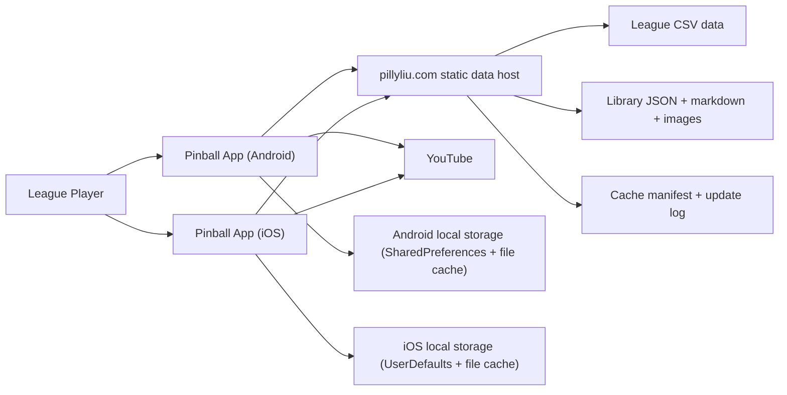

### 3.2 Container Diagram (C2)

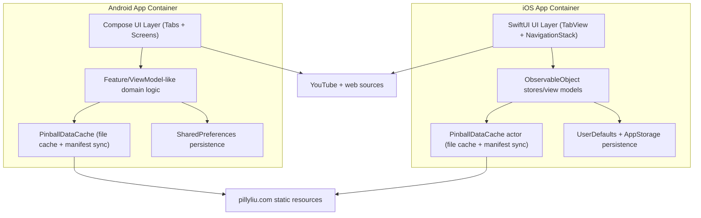

### 3.3 Component Diagrams (C3)

#### League module

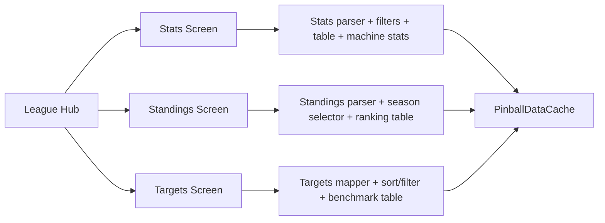

#### Library module

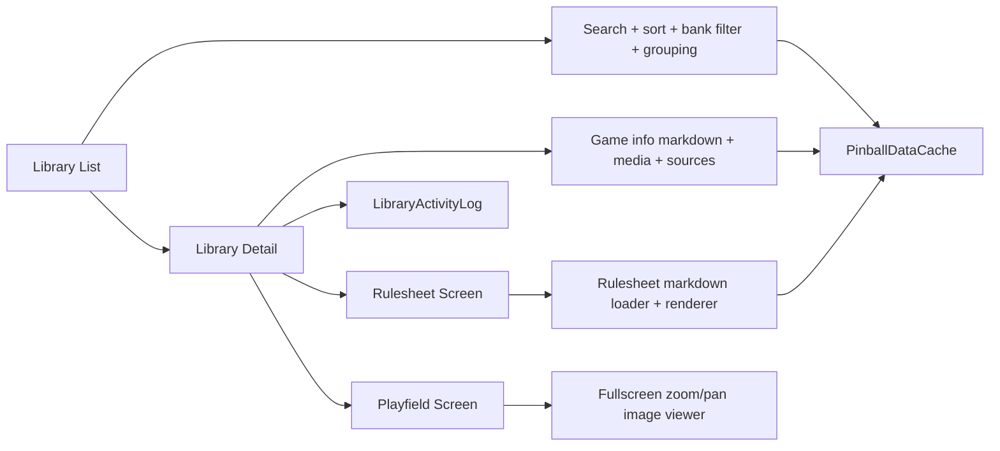

#### Practice module

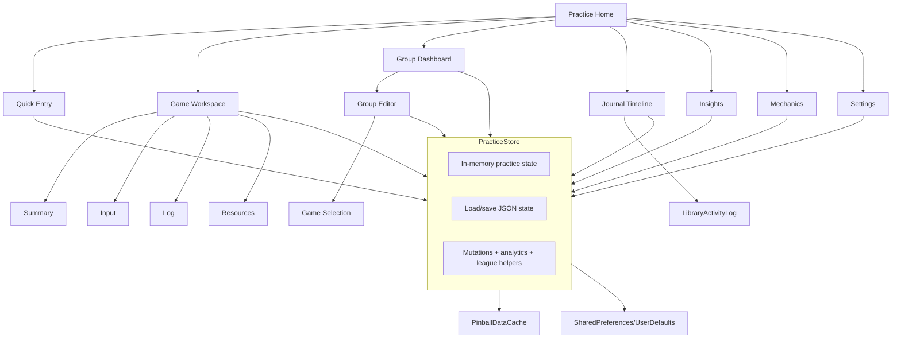

### 3.4 Code-Level Diagram (C4, feasible core)

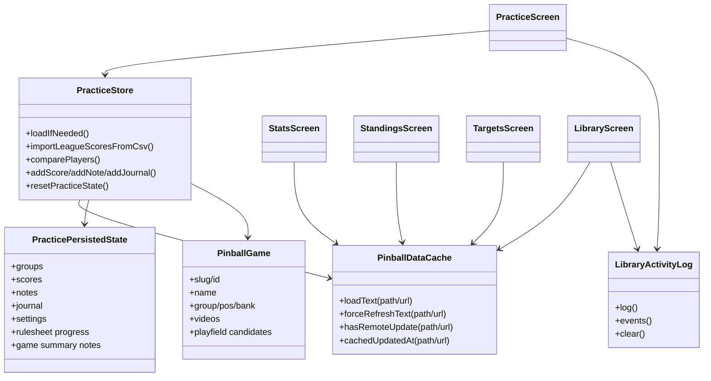

---

## 4. Screen and Feature Inventory

### Root navigation (both platforms)
- Tabs:
  - `League`
  - `Library`
  - `Practice`
  - `About`
- Navigation style:
  - Android: tab state + internal route enums.
  - iOS: `TabView` + `NavigationStack` per tab.

### League screens

| Screen | Purpose | Buttons/Controls/Filters | Navigation Targets | Data Reads | Data Writes |
|---|---|---|---|---|---|
| League Hub | Entry dashboard for league data | 3 destination cards: `Stats`, `Standings`, `Targets` | To corresponding league screens | `LPL_Stats.csv`, `LPL_Standings.csv`, `LPL_Targets.csv`, `pinball_library.json` (preview) | None |
| Stats | Score analytics + machine stats | Filters: season, bank, player, machine. Refresh control. iOS nav menu: `Clear all filters` + per-filter menus. | Back to League Hub | `LPL_Stats.csv`, redacted players CSV | In-memory filter state only |
| Standings | Season rankings and bank totals | Season selector (`Season N` menu), refresh control | Back to League Hub | `LPL_Standings.csv`, redacted players CSV | In-memory season selection |
| Targets | Per-game target benchmarks | Sort (`Location/Bank/A-Z`), bank filter (`All banks`/`Bank N`) | Back to League Hub | `LPL_Targets.csv` + `pinball_library.json` (mapping/sort metadata) | In-memory sort/filter state |

### Library screens

| Screen | Purpose | Buttons/Controls/Filters | Navigation Targets | Data Reads | Data Writes |
|---|---|---|---|---|---|
| Library List | Search and browse games | Search text box; sort menu (`Location`, `Bank`, `A-Z`); bank filter (`All banks`, `Bank N`) | Open `Library Detail` | `pinball_library.json` | Saves last viewed library game (`library-last-viewed-*`), logs browse event |
| Library Detail | Show game media + references | `Rulesheet`, `Playfield`; video tile buttons; source links (`Rulesheet (source)`, `Playfield (source)`) | To `Rulesheet`, `Playfield` | game info markdown (`/pinball/gameinfo/{slug}.md`), video thumbnails/YouTube IDs | Logs rulesheet/playfield/video events |
| Rulesheet Viewer | Read rulesheet markdown/web | Back, resume/continue controls (platform-specific), confirm dialogs in some flows | Back to detail/practice | `/pinball/rulesheets/{slug}.md` | Rulesheet progress ratio stored in practice state/preferences |
| Playfield Viewer | Fullscreen zoom/pan image viewer | Back; gesture zoom/pan (platform-specific) | Back to detail/practice | Playfield URLs (derived/local/remote candidates) | None |

### Practice screens and dialogs

| Screen | Purpose | Buttons/Controls/Filters | Navigation Targets | Data Reads | Data Writes |
|---|---|---|---|---|---|
| Practice Home | Main launchpad | `Resume` chip; `Game List`; quick entry buttons (`Score`, `Study`, `Practice`, `Mechanics`); hub cards (`Group Dashboard`, `Journal Timeline`, `Insights`, `Mechanics`); settings icon | To all practice feature screens; quick entry dialog | Practice state + library last-viewed pointers + game list | Updates last viewed game timestamp, opens dialogs/routes |
| Welcome Name Prompt | First-time name collection | `Save`, `Not now`, player name text field | Dismiss to home | Current player name state | Saves player profile name, prompt flags |
| Quick Entry (sheet/dialog) | Fast multi-mode logging | Mode/game pickers; mode-specific fields; `Save`, `Cancel` | Return to current/game route | Games list, current quick-entry defaults | Appends score/note/journal/study/mechanics events; updates remembered quick-entry game keys |
| Group Dashboard | Group status and game recommendations | Create (`+`), edit (`pencil`), group select, priority toggle, start/end date buttons, per-game open, delete game from group (context menu) | To Group Editor or Game Workspace | Groups, summaries, progress snapshots | Updates selected group, priority, dates; removes games from group |
| Group Editor | Create/update groups | `Cancel`, `Delete` (edit), `Create/Save`, template selectors (`None/Bank/Duplicate`), apply template buttons, title selector, reorder, active/priority toggles, type segmented control, position up/down, start/end date toggles and pickers | Back to dashboard; title selection screen | Groups + games list | Creates/updates/deletes/reorders group definitions |
| Group Game Selection | Pick titles for group | Search field, selectable game list/cards, `Done` | Back to group editor | Games list | Mutates selected game IDs/slugs for group draft |
| Journal Timeline | Unified activity history | Filter segmented control (`All`, `Study`, `Practice`, `Scores`, `Notes`, `League`) | Tap row opens Game Workspace | Practice journal + library activity log | Stores selected journal filter preference |
| Insights | Performance analytics + head-to-head | Game dropdown; opponent dropdown (`Select player`); refresh comparison button | None (within practice stack) | Practice scores; imported league data/player options | Saves comparison player selection; updates transient comparison result |
| Mechanics | Skill logging and trend review | Skill picker; competency slider; mechanics note field; `Log Mechanics Session`; `Dead Flip Tutorials` link | External tutorial site | Mechanics-tagged notes/history | Adds note/journal entries with skill tags and competency metadata |
| Practice Settings | Profile/import/reset settings | Player name field + `Save Profile`; league player menu + `Import LPL CSV`; cloud sync toggle; `Reset Practice Log` | Reset confirm dialog | Available league players | Updates profile, league import settings, sync flag; imports CSV into score/journal; full reset |
| Reset Confirm | Guard destructive reset | Text field (`Type reset`), confirm/cancel buttons | Back to settings | Current practice state | Clears practice state + clears library activity log |
| Group Date Picker | Edit start/end dates | Date picker + `Save`/`Clear`/`Cancel` | Back to dashboard/editor | Existing group dates | Updates group start/end date |
| Game Workspace | Per-game detailed workflow | Top game picker menu; subview segmented control (`Summary`, `Input`, `Log`); `Save Note`; `Rulesheet`; `Playfield`; video tile selection | To rulesheet/playfield screens from resources | Game data + game-specific entries | Saves game summary note; marks game browsed |
| Game Workspace Input subview | Task-specific logging shortcuts | Buttons for `Rulesheet`, `Tutorial`, `Gameplay`, `Playfield`, `Practice`, `Mechanics`, `Log Score` (Android) or task sheets (iOS) | Opens entry sheets/dialogs | Current game ID | Writes score/study/practice/mechanics events |
| Game Task Entry / Score Entry sheets | Structured per-task data input | Task forms, `Save`, `Cancel` | Back to Game Workspace | Current game + enum defaults | Writes study/score/note/journal data |

### About screen

| Screen | Purpose | Buttons/Controls/Filters | Navigation Targets | Data Reads | Data Writes |
|---|---|---|---|---|---|
| About | League intro/info | External links: `lansingpinleague.com`, `Facebook Group` | Browser | Static in-app copy/assets | None |

---

## 5. Screen Interaction Diagrams

### Stats screen state + interactions

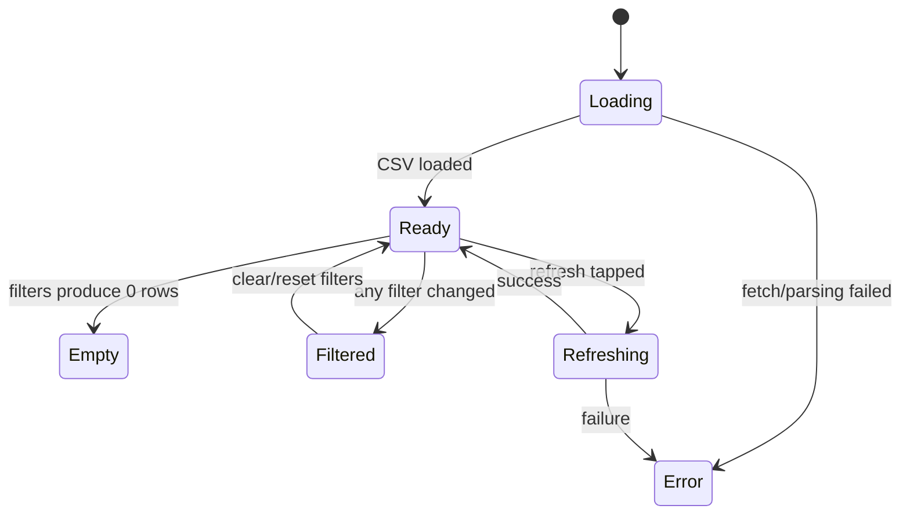

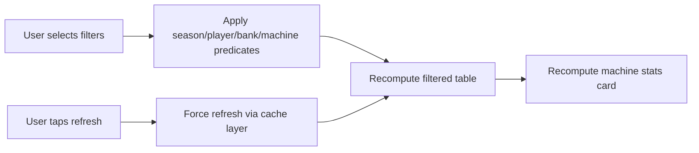

### Library list/detail flow

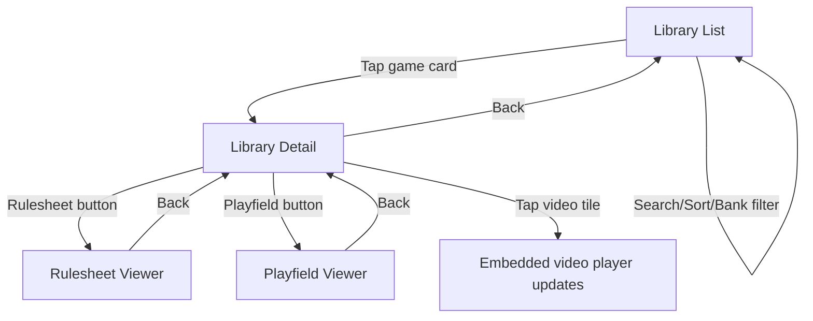

### Practice home + quick entry flow

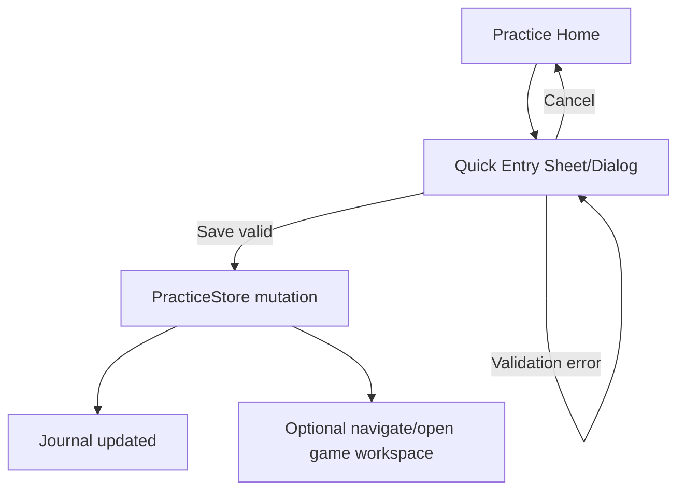

### Practice game workspace state

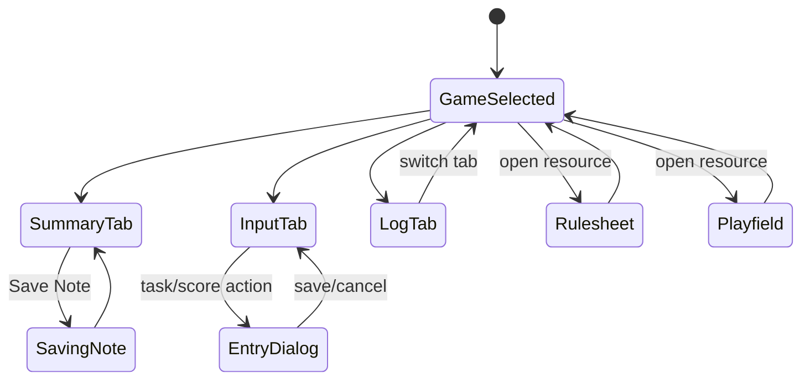

---

## 6. Sequence Diagrams (Behavior)

### App launch

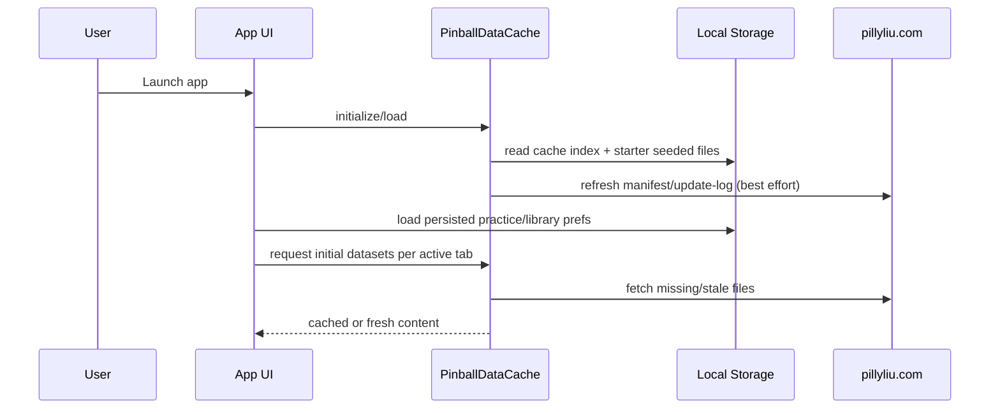

### Opening a game (Library -> Detail)

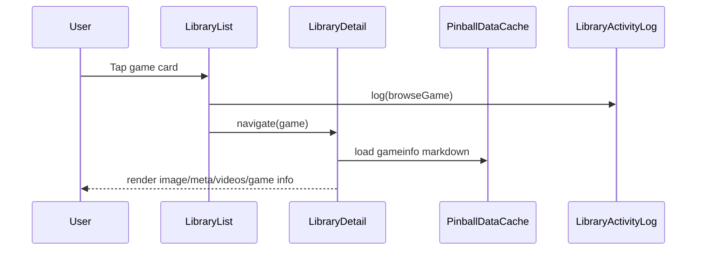

### Applying a filter (Stats)

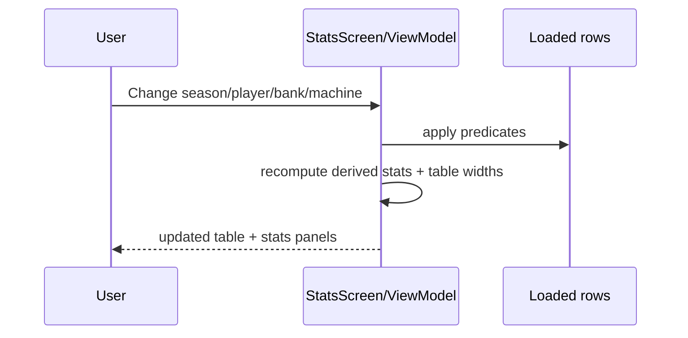

### Saving user data (Quick Entry / Game note)

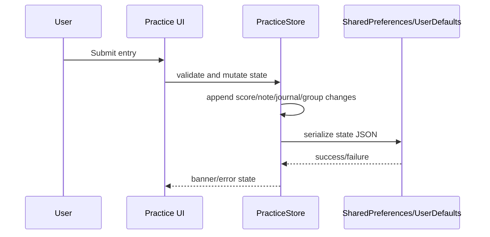

### Syncing/updating remote data

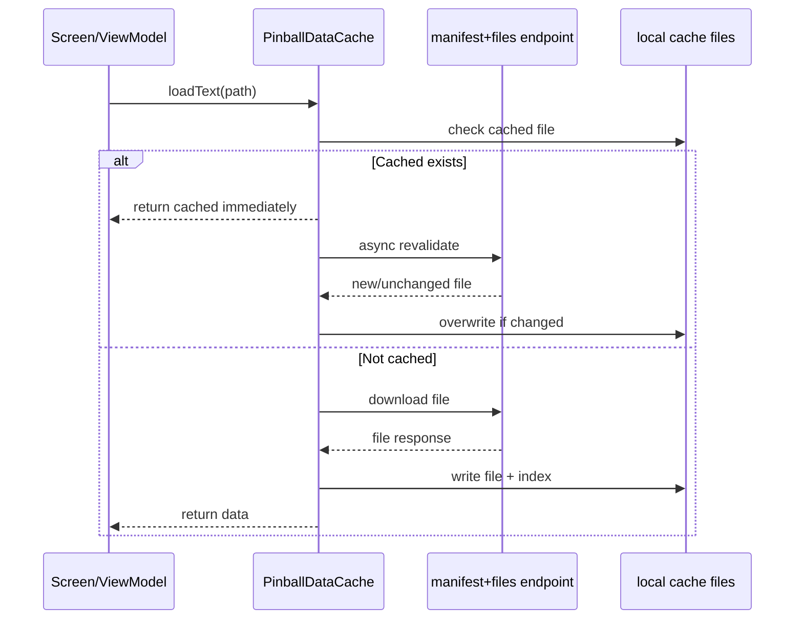

---

## 7. Data Model and Storage

### Core entities (domain-level)

- `PinballGame`
  - `slug/id`, `name`, `group`, `pos`, `bank`, `manufacturer`, `year`, media/rulesheet fields, `videos[]`.
- `Video`
  - `label`, `url` (and optional `kind` in iOS model).
- Practice entities
  - Groups: `PracticeGroup` / `CustomGameGroup`.
  - Scores: `ScoreEntry` / `ScoreLogEntry`.
  - Notes: `NoteEntry` / `PracticeNoteEntry`.
  - Journal: `JournalEntry`.
  - Derived analytics: `ScoreSummary`, `MechanicsSkillSummary`, `HeadToHeadComparison`, etc.
- Activity log
  - `LibraryActivityEvent` with kind (`browse/openRulesheet/openPlayfield/tapVideo`).

### Remote source datasets
- `/pinball/data/pinball_library.json`
- `/pinball/data/LPL_Stats.csv`
- `/pinball/data/LPL_Standings.csv`
- `/pinball/data/LPL_Targets.csv`
- `/pinball/data/redacted_players.csv`
- `/pinball/gameinfo/{slug}.md`
- `/pinball/rulesheets/{slug}.md`
- `/pinball/cache-manifest.json`
- `/pinball/cache-update-log.json`

### Local storage locations
- Android
  - `SharedPreferences`: `practice-upgrade-state-v2` and related keys.
  - Cache filesystem: `pinball-data-cache` + `cache-index.json`.
- iOS
  - `UserDefaults`: `practice-state-json` (+ legacy key) and app-storage keys.
  - Cache filesystem: `Caches/pinball-data-cache` + `cache-index.json`.

### Data loading, caching, update behavior
- Offline-first:
  - Prefer local cache if available.
  - Async/background revalidation to keep UI responsive.
- Starter pack seeding:
  - Assets/bundle preloaded for priority files and baseline data.
- Metadata-driven invalidation:
  - Manifest hashes + update-log removal events reconcile local cache.
- Graceful fallback:
  - If network fails and stale cache exists, stale content is served.
  - Missing-allowed paths are represented as missing entries.

### ER/Data model diagram

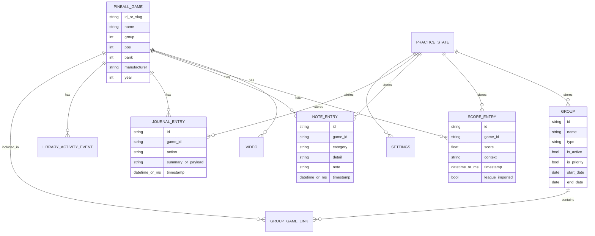

---

## 8. Data Flow Diagrams

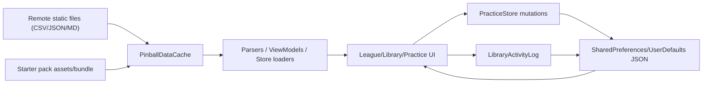

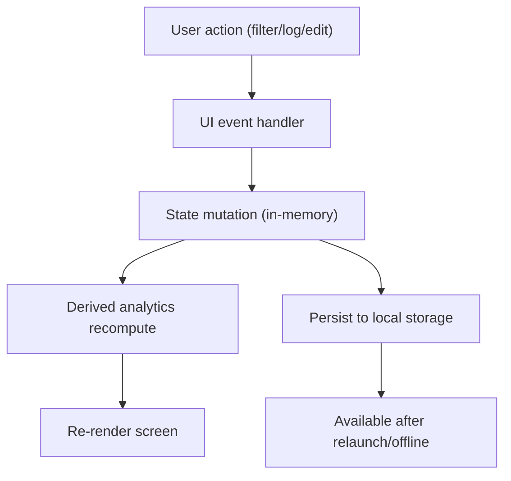

---

## 9. Navigation Map

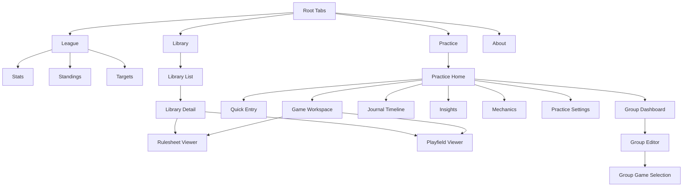

### Deep links
- No explicit deep-link URL handler implementation found in app code.
- Internal cross-tab navigation exists (iOS `AppNavigationModel.openLibraryGame`), but not OS-level URL deep links.  
- Assumption: deep links are currently not exposed publicly.

---

## 10. Error, Offline, and Edge Cases

### Data load failures
- League and library screens render error/empty messages when dataset fetch/parsing fails.
- Practice load/save failures set error strings and fallback to empty/default state (especially on decode failure).

### Offline behavior
- Cache-first strategy serves local/starter content while offline.
- If a file was never cached and no starter fallback exists, screen can show empty/error state.
- Revalidation failures keep stale cached data.

### Sync/update conflicts
- No multi-device conflict resolution yet.
- “Cloud sync” is explicitly optional placeholder/phase label; state remains device-local.
- Assumption: last local write wins within current device session.

### Empty states
- Common explicit empty states:
  - No rows for selected filters.
  - No games/groups selected.
  - No videos listed.
  - No journal events.
  - No head-to-head overlap for selected players.

### Input validation and guardrails
- Quick entry validates required fields by mode (score values, tournament name, etc.).
- Reset requires explicit `"reset"` confirmation text.
- Group editor validates naming/order and supports delete confirmations.

---

## 11. Final Architecture Summary

Pinball App is a two-client, offline-first mobile architecture with shared product behavior across Android and iOS. Both apps consume static league/library datasets from `pillyliu.com`, cache them aggressively with manifest-based freshness checks, and render feature modules organized as `League`, `Library`, `Practice`, and `About`.

Data flow is straightforward: remote static content enters through `PinballDataCache`, gets parsed into UI/store state, and user-generated practice data is persisted locally (SharedPreferences/UserDefaults JSON). The `Practice` module is the most stateful subsystem, combining structured logging, analytics, groups, and settings into a single persisted state model, while `LibraryActivityLog` augments journal timelines with browsing study behavior.

Key architectural decisions are:
- Offline-first cache with starter-pack bootstrap and async revalidation.
- Static-content backend (read-only app perspective).
- Strong modular separation by feature domain.
- Local-first persistence for user practice workflows.
- Incremental, composable UI navigation per tab with nested feature routes.
