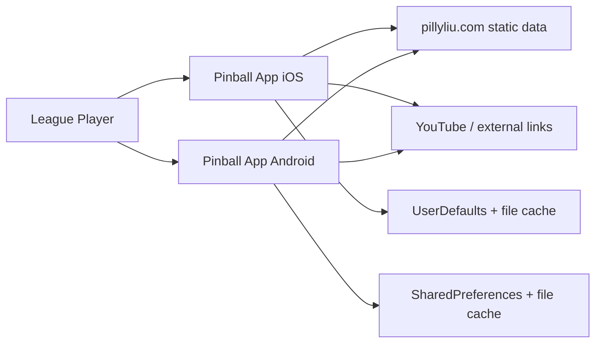
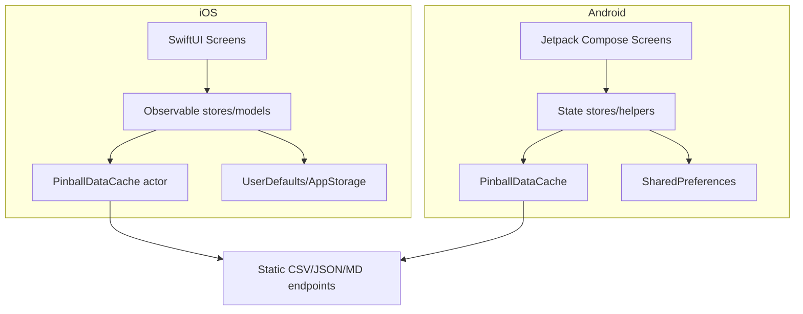
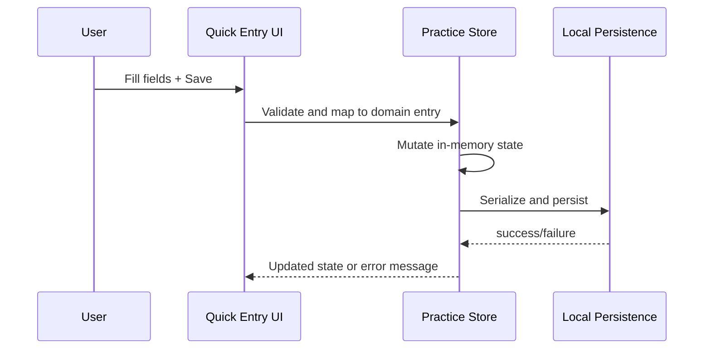
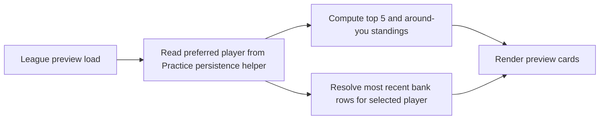

# Pinball App Architecture Blueprint (2026-02-27)

## 1. Purpose

This document is the current architecture reference for the full app and the active cleanup roadmap.

Scope:
- iOS app: `/Users/pillyliu/Documents/Codex/Pinball App/Pinball App 2/Pinball App 2`
- Android app: `/Users/pillyliu/Documents/Codex/Pinball App/Pinball App Android/app/src/main/java/com/pillyliu/pinballandroid`

Goals:
- Describe what ships today (modules, data flow, persistence, migration boundaries).
- Capture cleanup work completed through Phase 2.5.
- Define the next safe cleanup steps (Phase 3) with verification gates.

## 2. Product Architecture Snapshot

The product has four user-facing domains on both platforms:
- League: stats, standings, targets, mini-preview cards.
- Library: game browse/detail, playfield, rulesheet, videos, source links.
- Practice: quick entry, game workspace, groups, journal, insights, mechanics, settings.
- About: static league info and links.

Top-level design:
- Read-only remote data source (`https://pillyliu.com/pinball/...`) for league/library content.
- Offline-first cache + starter-pack seed on both platforms.
- Local-first user state for Practice and activity logs.
- No backend write API from app clients.

## 3. Repository and Runtime Boundaries

Repository layout:
- iOS: `/Users/pillyliu/Documents/Codex/Pinball App/Pinball App 2`
- Android: `/Users/pillyliu/Documents/Codex/Pinball App/Pinball App Android`
- Architecture docs:
  - `/Users/pillyliu/Documents/Codex/Pinball App/Pinball_App_Architecture_Blueprint.md`
  - `/Users/pillyliu/Documents/Codex/Pinball App/Pinball_App_Architecture_Blueprint_2026-02-27.md`
  - `/Users/pillyliu/Documents/Codex/Pinball App/Pinball_App_Architecture_Blueprint_print_layout.pdf`

Runtime data boundaries:
- Remote static content: CSV/JSON/Markdown/assets.
- Local cache files: `pinball-data-cache` managed by platform cache layers.
- Local user persistence: UserDefaults (iOS) and SharedPreferences (Android).

## 4. C4 Views

### 4.1 Context (C1)

### 4.2 Containers (C2)

### 4.3 Components (C3) by feature

League:
- iOS: `LeaguePreviewModel.swift`, `StatsScreen.swift`, `StandingsScreen.swift`, `TargetsScreen.swift`
- Android: `LeagueScreen.kt`, `StatsScreen.kt`, `StandingsScreen.kt`, `TargetsScreen.kt`

Library:
- iOS: `LibraryScreen.swift`, `LibraryDetailScreen.swift`, `LibraryDomain.swift`
- Android: `LibraryScreen.kt`, `LibraryDetailScreen.kt`, `LibraryDomain.kt`, `LibraryActivityLog.kt`

Practice core:
- iOS:
  - state: `PracticeStore.swift`, `PracticeModels.swift`
  - persistence/migration: `PracticeStorePersistence.swift`, `PracticeStateCodec.swift`, `PracticeIdentityKeying.swift`
  - UI: `PracticeScreen.swift`, `PracticeQuickEntrySheet.swift`, `PracticeMechanicsSection.swift`
- Android:
  - state: `PracticeStore.kt`, `PracticeModels.kt`
  - canonical persistence: `PracticeCanonicalPersistence.kt`
  - persistence helpers: `PracticeStorePreferenceHelpers.kt`, `PracticeStorePersistence.kt`, `PracticeKeys.kt`
  - UI: `PracticeScreen.kt`, `PracticeGameSection.kt`, `PracticeGroup*`, `PracticeJournal*`

## 5. Feature Inventory (Current Behavior)

### 5.1 League

Key behaviors:
- Stats, standings, targets load from latest CSVs with cache fallback.
- League preview cards on home use selected player from Practice settings when available.
- Standings mini-card supports both `Top 5` and `Around You` window logic.
- Around-you centering behavior handles first/last ranks with edge clamping.

Current sources:
- `/pinball/data/LPL_Stats.csv`
- `/pinball/data/LPL_Standings.csv`
- `/pinball/data/LPL_Targets.csv`
- `/pinball/data/pinball_library_v3.json`
- `/pinball/data/redacted_players.csv`

### 5.2 Library

Key behaviors:
- List supports search/sort/filter.
- Detail supports rulesheet/playfield/video consumption.
- Viewing activity contributes to journal timeline context.
- Library still supports compatibility fields in content payloads (`*_local_legacy`) when present.

### 5.3 Practice

Key behaviors:
- Quick Entry supports score, study, practice, mechanics, and video progress flows.
- Game Workspace has subviews (`Summary`, `Input`, `Log`) and resource shortcuts.
- Group dashboard/editor supports templates, date windows, ordering, and game management.
- Journal timeline merges practice entries and library activity.
- Insights uses local score data + imported league context.
- Mechanics supports skill log, competency tracking, history, and trend visualizations.

## 6. Practice Persistence and Migration Model

### 6.1 iOS (schema-evolved single model)

Primary files:
- `/Users/pillyliu/Documents/Codex/Pinball App/Pinball App 2/Pinball App 2/practice/PracticeStore.swift`
- `/Users/pillyliu/Documents/Codex/Pinball App/Pinball App 2/Pinball App 2/practice/PracticeStorePersistence.swift`
- `/Users/pillyliu/Documents/Codex/Pinball App/Pinball App 2/Pinball App 2/practice/PracticeStateCodec.swift`

Current keys:
- active: `practice-state-json`
- compatibility read: `practice-upgrade-state-v1`

Codec behavior:
- Canonical date strategy: milliseconds since 1970.
- Fallback decoder still exists for legacy Foundation `Date` encoding compatibility.
- `PracticeStateCodec.decode(_:)` now centralizes fallback handling.

### 6.2 Android (canonical shadow + runtime projection)

Primary files:
- `/Users/pillyliu/Documents/Codex/Pinball App/Pinball App Android/app/src/main/java/com/pillyliu/pinballandroid/practice/PracticeStore.kt`
- `/Users/pillyliu/Documents/Codex/Pinball App/Pinball App Android/app/src/main/java/com/pillyliu/pinballandroid/practice/PracticeCanonicalPersistence.kt`
- `/Users/pillyliu/Documents/Codex/Pinball App/Pinball App Android/app/src/main/java/com/pillyliu/pinballandroid/practice/PracticeStorePreferenceHelpers.kt`

Current keys:
- preference namespace: `practice-upgrade-state-v2`
- active state key: `practice-state-json`
- compatibility read key: `practice-upgrade-state-v1`

Model behavior:
- Canonical schema (`CANONICAL_PRACTICE_SCHEMA_VERSION = 4`) is persisted.
- Runtime shape is derived for existing UI callsites.
- Save path projects runtime deltas back into canonical shadow state.

### 6.3 Cross-platform migration test gates

Automated migration tests in repo:
- iOS: `Pinball App 2Tests/PracticeStateCodecTests.swift`
- Android: `PracticeCanonicalPersistenceTest.kt`

Release/CI gating has been wired so migration regressions fail before release packaging.

## 7. Data and Cache Architecture

Primary cached remote paths:
- `/pinball/data/pinball_library_v3.json`
- `/pinball/data/LPL_Targets.csv`
- `/pinball/data/LPL_Stats.csv`
- `/pinball/data/LPL_Standings.csv`
- `/pinball/data/redacted_players.csv`
- `/pinball/cache-manifest.json`
- `/pinball/cache-update-log.json`

Cache strategy:
- Read cache first when available.
- Revalidate in background or on force refresh.
- Seed from starter bundle/assets to improve first launch behavior.

Legacy cache markers kept intentionally:
- `starter-pack-seeded-v3-only`
- `legacy-cache-reset-v3-assets-v1`

These are historical markers and not immediate cleanup targets.

## 8. Screen-Level Interaction Flow

### 8.1 Practice quick-entry to persistence

### 8.2 League preview selected-player resolution

## 9. Cleanup Status Through Phase 2.5

Completed cleanup highlights:
- iOS league preview now uses shared practice persistence helper for player name lookup.
- iOS practice codec fallback decode logic is centralized (single helper path).
- Android call sites now use shared practice preference helpers instead of ad hoc key access.
- Android canonical migration conversion was deduped (`stableIdMap` and journal mapping simplification).
- Fixture-based migration tests exist on both platforms and are part of release/CI lanes.
- Temporary artifacts (`tmp_practice_key_crosswalk_*`) were removed and ignored.

Recent commit anchor:
- `5cdba2a` (`refactor practice codec and migration helpers (phase 2.5)`).

## 10. Phase 3 Cleanup Plan (Next)

Objective:
- Retire legacy compatibility branches once upgrade horizon is formally closed.

### 10.1 Planned removals (gated)

iOS candidates:
- Remove `practice-upgrade-state-v1` fallback reads.
- Remove fallback date-decoding branch in `PracticeStateCodec`.
- Remove legacy alias key-matching branches in `PracticeIdentityKeying`.

Android candidates:
- Remove fallback read of `practice-upgrade-state-v1`.
- Remove legacy runtime parser bridge path in canonical adapter.
- Remove canonical-to-legacy journal summary/action shims used only for compatibility.
- Remove legacy alias key-matching branches.

Shared candidate:
- Remove `*_local_legacy` content fallback fields once library payload audit confirms complete v3 coverage.

### 10.2 Exit gates before deletion

Must pass before any destructive retirement:
1. iOS migration fixtures green.
2. Android migration fixtures green.
3. CI green for both platforms.
4. Manual smoke flows:
- quick entry (all modes)
- game workspace input/log
- journal swipe/edit/delete
- group dashboard/editor
- league mini previews (selected-player behavior)

## 11. Risk Register

Current architectural risks:
- Platform divergence in migration semantics if cleanup is done asymmetrically.
- Hidden old installs still depending on fallback keys/date decoding.
- Removal of legacy library fields before content parity verification.

Mitigations in place:
- Fixture-based migration tests on both platforms.
- Shared helper boundaries for persistence reads.
- Staged retirement checklist in repo:
  - `/Users/pillyliu/Documents/Codex/Pinball App/Legacy_Path_Retirement_Checklist_2026-02-27.md`

## 12. Verification Matrix (Ongoing)

Automated baseline:
- iOS build + migration tests.
- Android compile + migration tests.

Recommended routine commands:
- iOS targeted migration tests:
  - `xcodebuild -project 'Pinball App 2.xcodeproj' -scheme 'Pinball App 2' -sdk iphonesimulator -destination 'platform=iOS Simulator,name=iPhone 17' -only-testing:'Pinball App 2Tests/PracticeStateCodecTests' test`
- Android targeted migration tests:
  - `./gradlew :app:compileDebugKotlin :app:testDebugUnitTest --tests com.pillyliu.pinballandroid.practice.PracticeCanonicalPersistenceTest`

Manual UX checks:
- practice quick entry layout/function
- game view input/log selector transitions
- journal row reveal-close priority
- group edit/reorder and delete affordances
- time-entry picker behavior by platform

## 13. Architecture Decisions (Current)

Accepted decisions:
- Keep offline-first + static data host architecture.
- Keep local-first practice persistence per device.
- Keep migration compatibility active until Phase 3 gates are explicitly satisfied.
- Keep Android canonical shadow model until runtime projection cleanup can be done safely.

Deferred decisions:
- AGP modernization and deprecation warning elimination (separate stream).
- Cross-device cloud sync (still phase-labeled, not shipped as true sync).

## 14. Update Policy for This Blueprint

When architecture changes:
1. Update this markdown file first.
2. Regenerate print-layout PDF from this source.
3. Keep `Pinball_App_Architecture_Blueprint.md` aligned with the latest baseline.
4. Include commit references for major architecture shifts.

