# 1. Release Snapshot

## Document purpose
This blueprint is the current-state architecture reference for PinProf version `3.5.0`.

It is intended to describe what ships today across both mobile apps:
- iOS app: `Pinball App 2`
- Android app: `Pinball App Android`

This version reflects the current five-tab product footprint, the GameRoom baseline, the expanded Settings surface, the shared design-system cleanup, the CAF publish path, and the current release/CI path.

## Product summary
PinProf is a dual-platform pinball companion app for league players and home collectors. It combines:
- league performance tracking
- library browsing and study resources
- personal practice workflow and analytics
- personal machine ownership and maintenance logging
- settings, imports, and hosted data management

## What ships in 3.5.0
- Five root tabs on both platforms: `League`, `Library`, `Practice`, `GameRoom`, `Settings`
- A CAF runtime data contract on both platforms built around:
  - `opdb_export.json`
  - `rulesheet_assets.json`
  - `video_assets.json`
  - `playfield_assets.json`
  - `gameinfo_assets.json`
  - `backglass_assets.json`
  - `venue_layout_assets.json`
  - league CSVs and related hosted support files
- Library, Practice, and GameRoom assembly now driven from OPDB identities, asset databases, imported-source state, and owned-machine overlays instead of runtime dependence on legacy stitched library payload files
- Local-first persistence for practice progress, journal history, settings, imported-source preferences, and GameRoom machine data
- Stronger cross-platform parity through shared screen/background/fullscreen chrome seams and matched CAF behavior
- Android release automation via Fastlane and build validation in GitHub Actions

## Product goals
- Keep iOS and Android functionally aligned within reason
- Preserve native platform expression where it improves clarity or reliability
- Make hosted content resilient offline
- Reflect the real current publish chain from PinProf Admin through the website deploy repo, while keeping app-only support assets owned by the app workspace
- Let users move fluidly from browsing to studying, logging, and machine ownership workflows

## Root experience map
1. `League`
2. `Library`
3. `Practice`
4. `GameRoom`
5. `Settings`

---

# 2. System Overview

## Core user jobs
- Track league standings, score history, and score targets
- Browse rulesheets, playfields, videos, and machine notes
- Log practice, study, score, and mechanics progress quickly
- Organize training into groups, journal entries, insights, and IFPA-linked identity
- Manage owned machines, service history, issues, media, and archive state
- Refresh or extend hosted content through curated imports and data management tools

## Shared product principles
- Hosted content is read-only and served from `https://pillyliu.com/pinball/...`
- Apps consume hosted `/pinball` payloads and local feature state; they do not talk to the admin DB directly
- OPDB export is the machine/reference truth used by runtime Library, Practice search, manufacturer browsing, and GameRoom catalog/media lookup
- PinProf asset databases are separate hosted layers keyed by OPDB identity, not one merged monolithic library file
- `practice_identity` remains a compatibility key derived from the group portion of `opdb_id`, not a separate source-of-truth domain
- User-generated data is persisted locally on device
- Library is shared infrastructure, not an isolated tab
- Practice and GameRoom each have their own local domain stores
- Root shells are lightweight; route contexts, loader seams, store helpers, and shared UI chrome carry most of the composition work
- PinProf Admin is the source of truth for canonical content and hosted assets, while the website repo still owns the deploy entrypoint

## Current parity posture
- Both platforms now use CAF/raw OPDB runtime loading for the main Library path, Practice source-aware browsing, GameRoom catalog/media lookup, and hosted refresh behavior
- League, Library, GameRoom, and Settings are structurally stable
- Practice remains the largest active complexity surface, but its route seams and state ownership are more explicit on both platforms than earlier builds
- Shared background, fullscreen, resource, and action chrome have been normalized across platforms where practical

---

# 3. Technology Stack

## Languages, frameworks, and build systems
- iOS
  - Swift
  - SwiftUI
  - Combine
  - Foundation
  - CryptoKit
  - UIKit bridges for gestures, fullscreen viewers, and camera flows
  - WebKit for hosted-web fallback content
- Android
  - Kotlin
  - Jetpack Compose Material3
  - Kotlin coroutines
  - AndroidX lifecycle, activity, splashscreen, and camera components
  - Coil for image loading
  - CommonMark plus compose-richtext for markdown rendering
- Build and automation
  - iOS: Xcode project `Pinball App 2.xcodeproj`
  - Android: Gradle Kotlin DSL
  - Android releases: Fastlane
  - CI: GitHub Actions

## Local storage and persistence
- iOS
  - `UserDefaults` and `AppStorage` for preferences and persisted feature state
  - file cache under `Caches/pinball-data-cache`
- Android
  - `SharedPreferences` for feature state and settings
  - file cache under the app cache directory
- The apps ship a curated preload bundle for core data plus app-owned bundled support assets under `SharedAppSupport`
- Runtime no longer depends on `starter-pack`, `PinballStarter.bundle`, `pinball_library_v3.json`, or seed DB files

## Published runtime content contracts
- Hosted CAF layers
  - `/pinball/data/opdb_export.json`
  - `/pinball/data/rulesheet_assets.json`
  - `/pinball/data/video_assets.json`
  - `/pinball/data/playfield_assets.json`
  - `/pinball/data/gameinfo_assets.json`
  - `/pinball/data/backglass_assets.json`
  - `/pinball/data/venue_layout_assets.json`
- Hosted league/support files
  - `/pinball/data/LPL_Stats.csv`
  - `/pinball/data/LPL_Standings.csv`
  - `/pinball/data/LPL_Targets.csv`
  - `/pinball/data/lpl_targets_resolved_v1.json`
  - `/pinball/data/redacted_players.csv`
- Hosted cache metadata
  - `/pinball/cache-manifest.json`
  - `/pinball/cache-update-log.json`
- App-owned bundled support files
  - `SharedAppSupport/pinside_group_map.json`
  - `SharedAppSupport/shake-warnings/*`
  - `SharedAppSupport/app-intro/*`

## External data, source-of-truth, and integrations
- PinProf Admin canonical workspace
  - `workspace/db/pinprof_admin_v1.sqlite`
  - `workspace/assets/playfields/*`
  - `workspace/assets/backglasses/*`
  - `workspace/assets/rulesheets/*`
  - `workspace/assets/gameinfo/*`
  - `scripts/importers/*`
  - `scripts/publish/*`
- Pinball App shared support workspace
  - `Pinball App 2/Pinball App 2/SharedAppSupport/*`
- Current publish/deploy chain
  - PinProf Admin rebuilds published outputs
  - the `Pillyliu Pinball Website` repo still deploys the current remote `/pinball` payload
- Third-party or external destinations and sources
  - OPDB export API
  - YouTube
  - IFPA web profile pages
  - Pinball Map venue import
  - Match Play tournament import
  - Pinside import for GameRoom
  - external rulesheet discovery sources used upstream in publish scripts

## Current version anchors
- iOS marketing version: `3.5.0`
- Android target version for this release: `3.5.0`
- Practice canonical persisted schema: `v4`
- Primary runtime content contract: CAF hosted layers over OPDB identities
- App-owned support artifacts: bundled `pinside_group_map.json`, shake-warning art, and intro overlay source images

---

# 4. C4 Architecture Diagrams

## 4.1 System Context (C1)

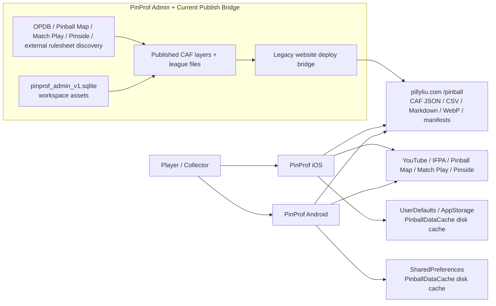

## 4.2 Runtime Containers (C2)

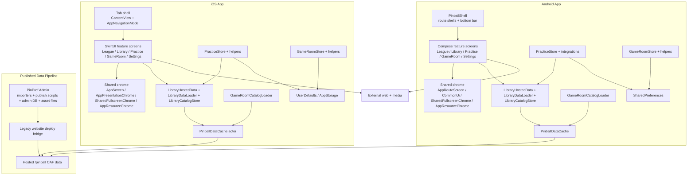

## 4.3 Feature Components (C3)

### League

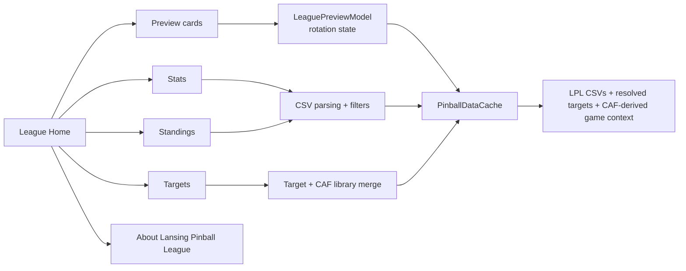

### Library

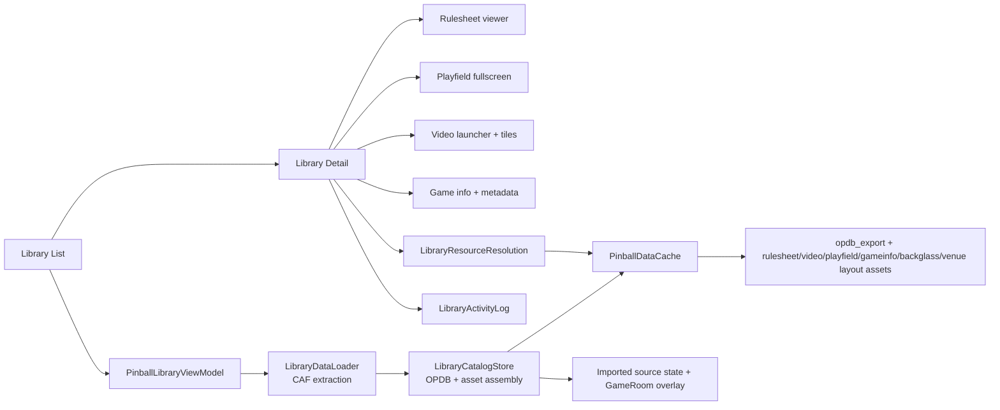

### Practice

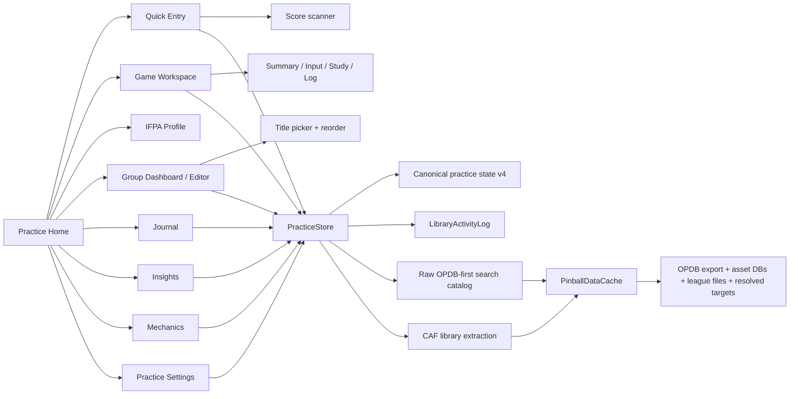

### GameRoom

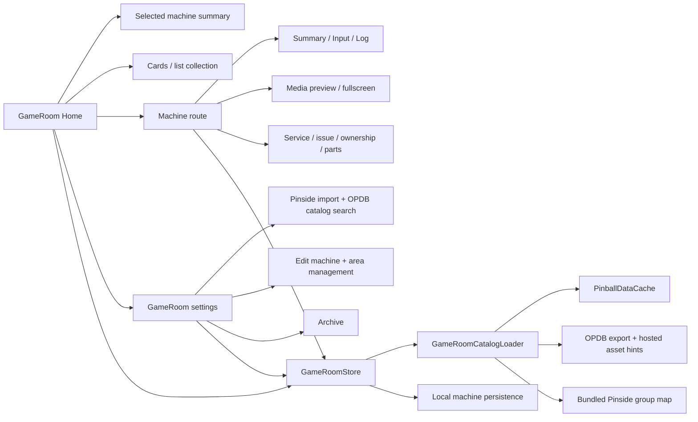

### Settings

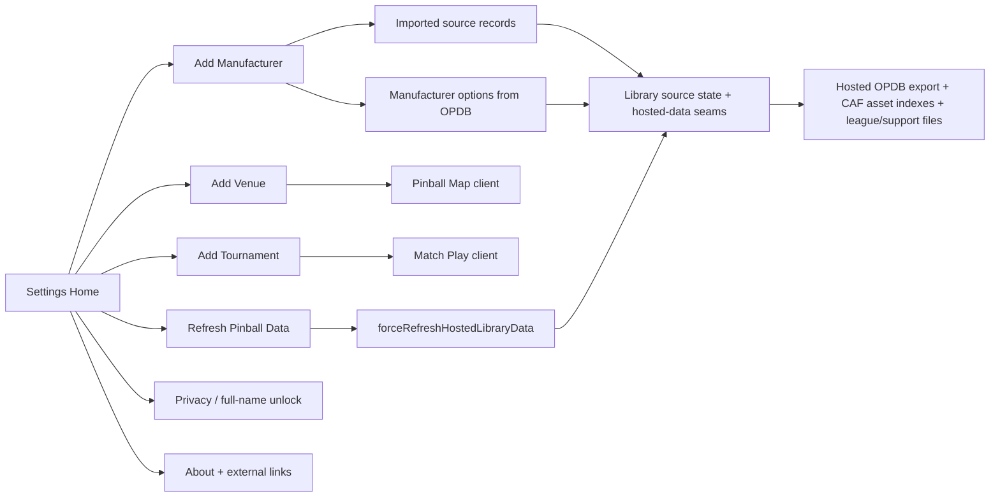

## 4.4 Shared Services and Presentation Layer

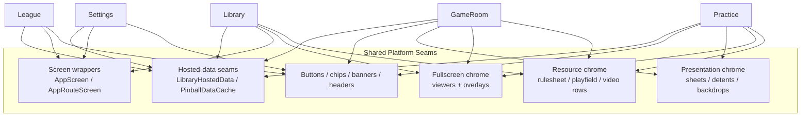

## 4.5 Code-Level Diagram (C4, feasible)

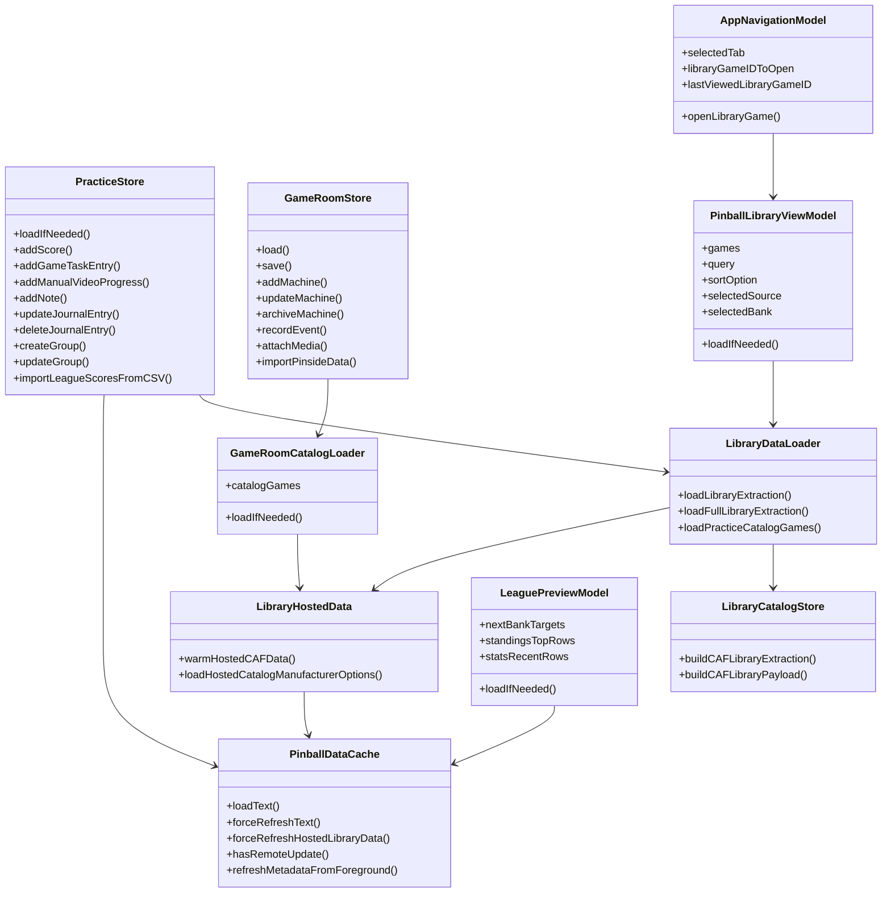

---

# 5. Screen and Feature Inventory

## 5.1 Root tabs
1. `League`
2. `Library`
3. `Practice`
4. `GameRoom`
5. `Settings`

## 5.2 League family
1. `League Home`
- Purpose: top-level gateway into league-specific destinations
- Main content:
  - animated preview cards
  - destination cards
  - nested `About Lansing Pinball League`
- Reads:
  - selected player context from Practice persistence
  - standings, stats, targets, and CAF-derived library game context
- Writes:
  - in-memory preview rotation and destination selection only

2. `Stats`
- Purpose: row-level league results plus machine score tables
- Controls:
  - season, bank, player, and machine filters
  - refresh status row
  - filter reset
- Reads:
  - `/pinball/data/LPL_Stats.csv`
- Writes:
  - transient filter state only

3. `Standings`
- Purpose: season standings with top-five and around-you logic
- Controls:
  - season filter
  - refresh status row
- Reads:
  - `/pinball/data/LPL_Standings.csv`
- Writes:
  - transient season state only

4. `Targets`
- Purpose: target benchmarks for banks and machines
- Controls:
  - sort selector
  - bank selector
  - filter menu
- Reads:
  - `/pinball/data/LPL_Targets.csv`
  - CAF-derived library game context assembled from OPDB plus asset databases
- Writes:
  - transient filter state only

5. `About Lansing Pinball League`
- Purpose: nested informational page under the League feature
- Content:
  - LPL context
  - external links

## 5.3 Library family
1. `Library List`
- Purpose: browse the full game catalog
- Controls:
  - search field and search icon
  - source picker
  - sort menu
  - bank filter menu
  - game cards or rows
- Reads:
  - CAF runtime extraction assembled from OPDB export, asset databases, imported-source state, and GameRoom overlays
- Writes:
  - preferred library source
  - last viewed library game handoff state

2. `Library Detail`
- Purpose: inspect a specific game
- Content:
  - hero image
  - metadata and game info
  - rulesheet/playfield resource actions
  - playable video list and launch panel
  - external/open-in-YouTube actions
- Reads:
  - rulesheet candidates
  - playfield candidates
  - video metadata
- Writes:
  - library activity events
  - last viewed game state

3. `Rulesheet`
- Purpose: read rulesheet content with progress memory
- Supports:
  - local markdown
  - hosted markdown
  - external-web fallback when the content is URL-only or not parseable
- Writes:
  - rulesheet progress and resume offsets

4. `Playfield`
- Purpose: full-resolution playfield viewing
- Controls:
  - pinch zoom
  - double-tap zoom
  - panning
  - fullscreen chrome auto-hide
- Writes:
  - no primary data writes

5. `Video resources`
- Purpose: reference tutorial, gameplay, and competition video material
- Behavior:
  - shared ordering by category and natural sequence
  - launch from Library and Practice
  - activity logging for video taps

## 5.4 Practice family
1. `Practice Home`
- Purpose: resume, launch, and route into the full practice system
- Content:
  - welcome header and player identity
  - resume/recent game state
  - source and game selectors
  - quick-entry buttons
  - active group summary
  - destination cards for groups, journal, insights, and mechanics
- Writes:
  - selected game and source memory
  - last viewed practice state

2. `Name Prompt / Welcome`
- Purpose: first-run identity capture
- Controls:
  - player name field
  - optional league import linkage
  - save / dismiss actions
- Writes:
  - practice profile identity and greeting state

3. `Quick Entry`
- Purpose: fast logging from home or game context
- Modes:
  - `Score`
  - `Rulesheet`
  - `Tutorial`
  - `Gameplay`
  - `Playfield`
  - `Practice`
  - `Mechanics`
- Inputs:
  - source and game
  - score context
  - video progress kind (`Percentage` or `hh:mm:ss`)
  - notes and activity metadata
  - optional score scanner
- Writes:
  - canonical practice entries
  - score logs
  - journal rows
  - video progress
  - practice and mechanics progress

4. `Game Workspace`
- Purpose: game-specific practice command center
- Shared top-level sections:
  - inline playfield or image preview
  - main workspace panel
  - freeform game note
- Workspace subviews:
  - `Summary`
  - `Input`
  - `Study`
  - `Log`
- `Summary` includes:
  - next action
  - alerts
  - score consistency
  - target context
  - group progress
- `Input` includes:
  - `Rulesheet`
  - `Playfield`
  - `Score`
  - `Tutorial`
  - `Practice`
  - `Gameplay`
- `Study` includes:
  - resource rows
  - rulesheet chips
  - playfield chips
  - video launcher and tiles
- `Log` includes:
  - filtered journal rows for the selected game
  - edit and delete flows
  - constrained scrolling
- Writes:
  - browse/viewed events
  - game summary note
  - entries created from embedded input flows

5. `IFPA Profile`
- Purpose: tie the player identity header to IFPA information
- Reads:
  - IFPA profile data from the public web profile page
- Writes:
  - selected IFPA player ID where applicable

6. `Group Dashboard`
- Purpose: manage practice groups and active focus
- Controls:
  - current vs archived grouping
  - create and edit
  - archive and restore
  - priority toggles
  - start/end dates
  - open game from group context
- Writes:
  - group metadata and status

7. `Group Editor`
- Purpose: build and reorder group membership
- Controls:
  - group name
  - template options
  - title picker
  - drag reorder
  - anchored delete popover for title removal
  - active / priority / archived flags
  - date windows
- Writes:
  - group definitions and order

8. `Group Title Selection`
- Purpose: searchable game selection for group membership
- Controls:
  - search
  - source filter
  - row selection

9. `Journal`
- Purpose: merged timeline of practice and library activity
- Controls:
  - category filters
  - batch selection/edit/delete
  - row tap into game
  - per-row edit and delete actions
- Writes:
  - journal edits and deletions

10. `Insights`
- Purpose: derived performance analysis
- Content:
  - score distributions
  - trends
  - head-to-head comparison
  - league-linked context

11. `Mechanics`
- Purpose: skill and competency tracking
- Content:
  - skill log
  - competency history
  - trend summaries
  - note capture

12. `Practice Settings`
- Purpose: practice-specific configuration and reset/import actions
- Content:
  - league player linkage
  - import and reset actions
  - analytics and sync preferences

## 5.5 GameRoom family
1. `GameRoom Home`
- Purpose: personal machine overview
- Content:
  - selected machine summary
  - collection cards or list rows
  - snapshot metrics
  - route into machine detail or settings
- Writes:
  - selected machine and UI layout preferences

2. `Machine Route`
- Purpose: operate on one owned machine
- Subviews:
  - `Summary`
  - `Input`
  - `Log`
- Content:
  - current snapshot
  - machine metadata
  - service events
  - issue tracking
  - ownership and part/mod entries
  - media preview and fullscreen
- Writes:
  - machine events, status, notes, and attachments

3. `GameRoom Settings`
- Purpose: machine and collection management
- Content:
  - Pinside import review
  - add-machine search
  - archive management
  - area management
  - edit machine metadata
- Writes:
  - owned machine collection state
  - archive state
  - imported metadata

4. `GameRoom Presentation flows`
- Purpose: modal and fullscreen support for machine logging
- Surfaces:
  - service entry
  - issue entry and resolution
  - ownership update
  - media picker and preview
  - event edit

## 5.6 Settings family
1. `Settings Home`
- Purpose: hosted data management, integrations, privacy, and about
- Content:
  - existing library sources
  - add source actions
  - `Refresh Pinball Data`
  - privacy controls
  - about / attribution links

2. `Add Manufacturer`
- Purpose: extend Library and Practice with curated manufacturer payloads
- Writes:
  - imported source records

3. `Add Venue`
- Purpose: import venue machine lists from Pinball Map
- Inputs:
  - search query or location-based search
  - radius
- Writes:
  - imported venue source record

4. `Add Tournament`
- Purpose: import tournament arena lists from Match Play
- Inputs:
  - tournament ID or URL
- Writes:
  - imported tournament source record

5. `Privacy and attribution`
- Purpose:
  - full-name unlock and privacy choices
  - product and data-source attribution

## 5.7 Cross-feature presentation surfaces
- `App Shake Warning`
  - custom full-screen overlay on both platforms
- `Score Scanner`
  - camera-based score capture in Practice
- `Rulesheet` and `Playfield` fullscreen viewers
  - shared fullscreen chrome and resource presentation seams

---

# 6. Interaction Diagrams

## 6.1 App launch and background refresh

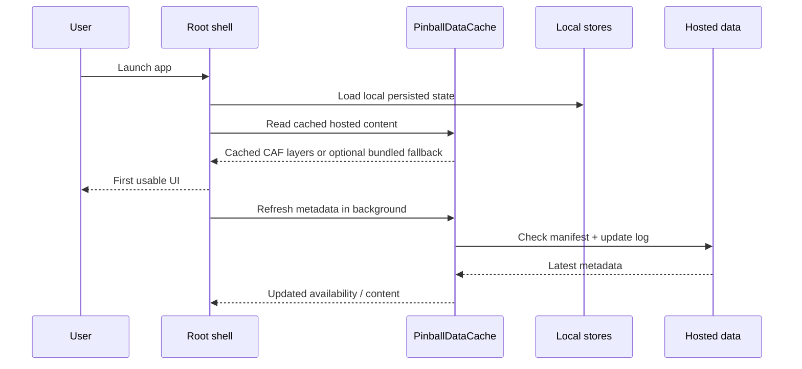

## 6.2 Library browse to detail to practice continuation

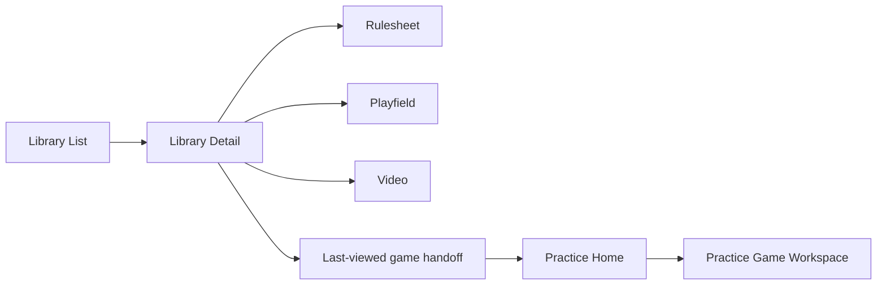

## 6.3 Quick entry save flow

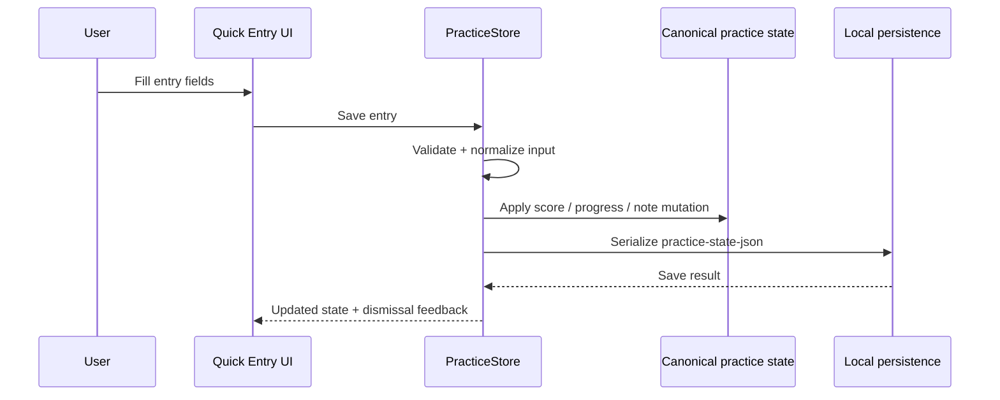

## 6.4 Group editor flow

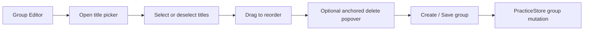

## 6.5 GameRoom service and media flow

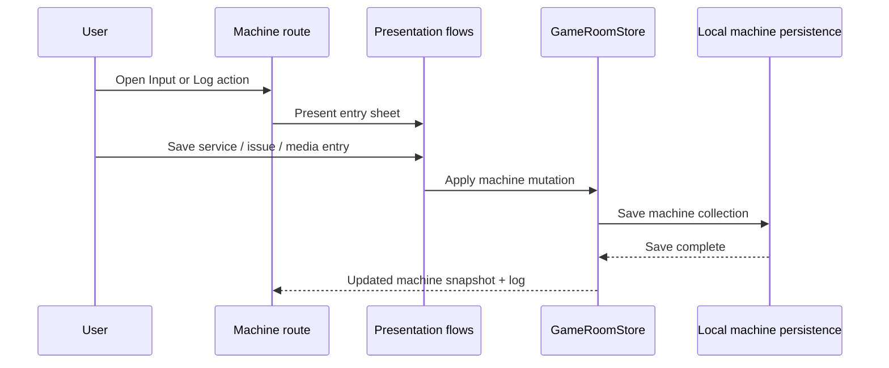

---

# 7. Data Model and Storage

## 7.1 Primary hosted runtime contracts
- Core CAF machine and asset layers
  - `opdb_export.json`
  - `rulesheet_assets.json`
  - `video_assets.json`
  - `playfield_assets.json`
  - `gameinfo_assets.json`
  - `backglass_assets.json`
  - `venue_layout_assets.json`
- League and support files
  - `LPL_Stats.csv`
  - `LPL_Standings.csv`
  - `LPL_Targets.csv`
  - `lpl_targets_resolved_v1.json`
  - `redacted_players.csv`
- Cache metadata
  - `cache-manifest.json`
  - `cache-update-log.json`
- App-owned bundled support
  - `SharedAppSupport/pinside_group_map.json`
  - `SharedAppSupport/shake-warnings/*`
  - `SharedAppSupport/app-intro/*`

## 7.2 Upstream source-of-truth and publish chain
- PinProf Admin owns the source of truth for:
  - admin DB state in `pinprof_admin_v1.sqlite`
  - canonical playfield, backglass, rulesheet, and game-info files
  - importer outputs from OPDB, Pinball Map, Match Play, and external rulesheet discovery
  - publish scripts that rebuild public-safe outputs
- The `Pillyliu Pinball Website` repo still acts as the current deploy bridge:
  - stages the hosted `/pinball` payload from `PinProf Admin/workspace`
  - rebuilds the staged `cache-manifest.json` and `cache-update-log.json` during deploy
  - stages the remote `/pinball` tree consumed by the apps
- The app workspace owns shared support files that are bundled locally into both apps:
  - `pinside_group_map.json`
  - shake-warning art
  - intro overlay source images

## 7.3 Primary local persisted domains
- Practice
  - canonical persisted state
  - score entries
  - study events
  - video progress
  - note entries
  - journal entries
  - custom groups
  - settings and resume hints
- Library
  - activity log
  - browsing preferences
  - source enable/pin/selection state
  - rulesheet resume progress
- GameRoom
  - owned machines
  - exact stored machine `opdb_id`
  - archive state
  - media references
  - event logs
- Settings
  - imported source records
  - privacy choices
  - preferred display or shell behavior as applicable

## 7.4 Storage locations
- iOS
  - feature state in `UserDefaults` and `AppStorage`
  - hosted/cache data in `Caches/pinball-data-cache`
- Android
  - feature state in `SharedPreferences`
  - hosted/cache data in the app cache directory
- Bundled support note
  - both platforms also bundle app-owned support artifacts from `SharedAppSupport`
  - the active runtime path is hosted CAF data plus disk cache, with no starter-pack dependency

## 7.5 Runtime assembly and identity rules
- Library assembly
  - build browsable source rows from imported source state, OPDB-derived manufacturer groupings, built-in source rules, and GameRoom synthetic source injection
  - build game rows from raw OPDB machine/reference data plus asset-database rows and optional venue layout overlays
- Practice assembly
  - source-scoped browsing uses the same CAF extraction used by Library
  - search and manufacturer-style browsing use OPDB-first loaders
- GameRoom assembly
  - owned-instance state is local and canonical for GameRoom
  - catalog search, artwork candidates, and Pinside-group linkage come from hosted OPDB/support files
- Identity rules
  - canonical public machine identity is `opdb_id`
  - group-level compatibility identity is derived from the group portion of `opdb_id`
  - Practice persistence and matching remain group-based for compatibility
  - GameRoom owned machines preserve the exact machine `opdb_id`

## 7.6 Current runtime relationship diagram

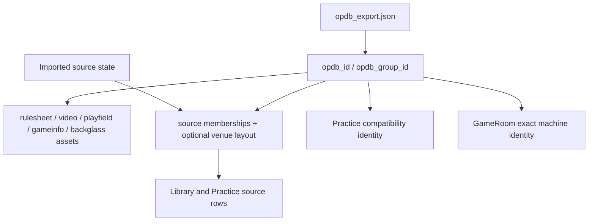

---

# 8. Data Flow and Background Behavior

## 8.1 Hosted content refresh

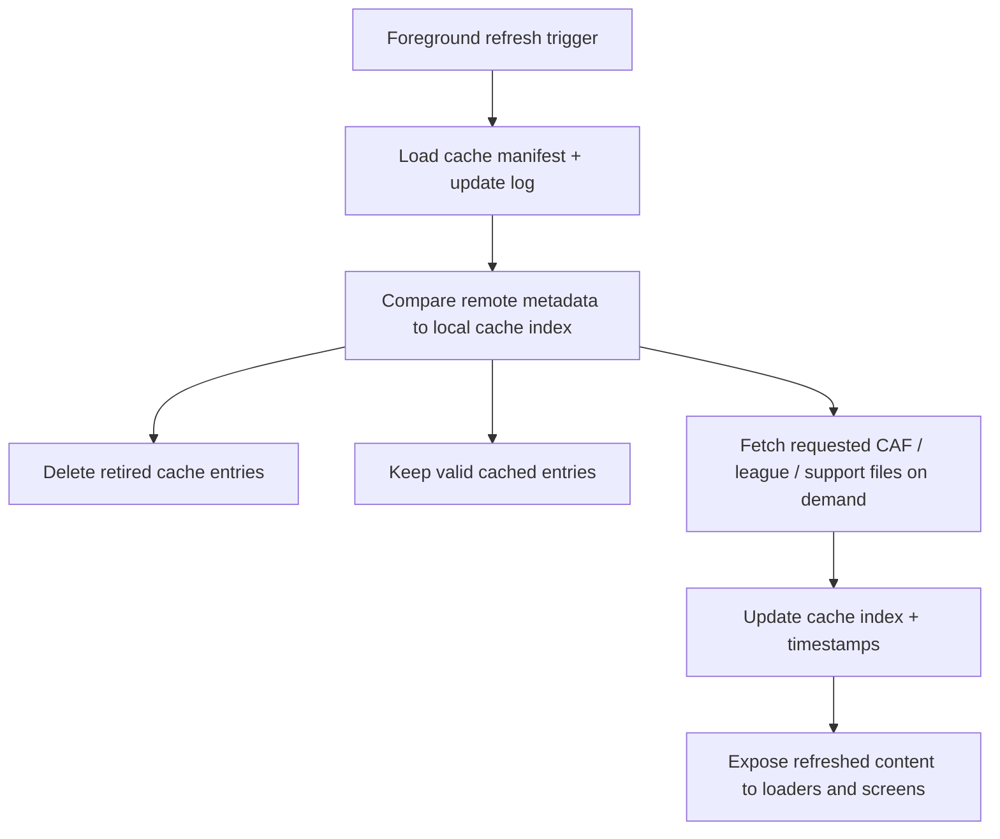

## 8.2 CAF runtime assembly

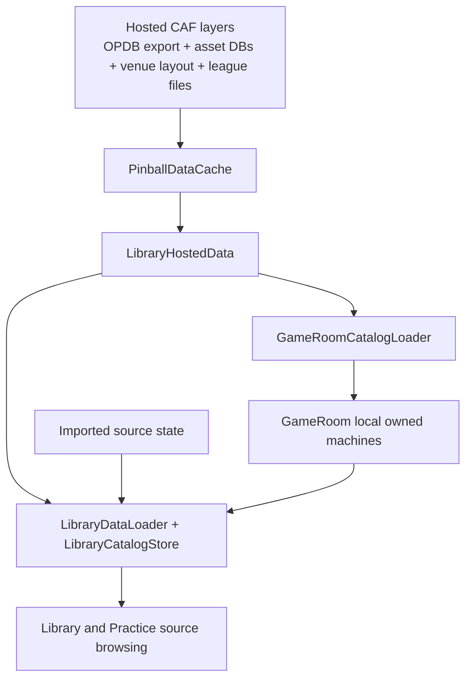

## 8.3 Practice and GameRoom identity behavior

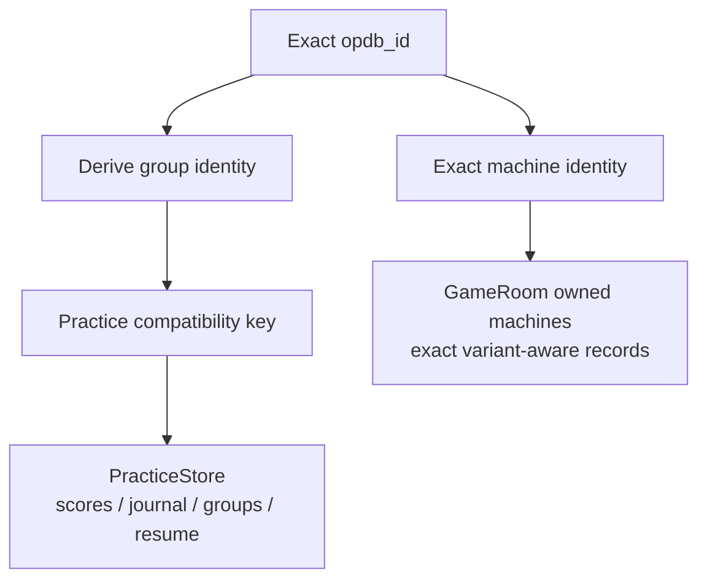

---

# 9. Navigation Map

## 9.1 Root and nested routes

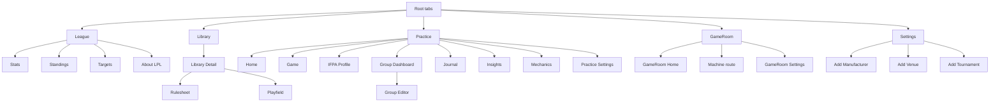

## 9.2 Cross-screen handoffs
- Library can hand the last-viewed game into Practice context
- Practice can open Library-derived rulesheet and playfield drill-ins
- Settings imports extend the Library source universe used by both Library and Practice through imported-source state, not default built-in venue rows
- GameRoom overlays use Library-backed machine metadata contracts while preserving exact local owned-machine identity

## 9.3 Shared presentation behavior
- iOS uses `AppScreen`, `NavigationStack`, and shared presentation chrome as the default wrapper pattern
- Android uses `AppRouteScreen`, `PinballShell`, and shared `CommonUi` seams for the same role
- Fullscreen readers and media viewers share dedicated fullscreen chrome on both platforms

---

# 10. Testing, Release, and Production Delivery

## 10.1 Local validation gates
- iOS build
  - `xcodebuild build -project "Pinball App 2/Pinball App 2.xcodeproj" -scheme "PinProf"`
- iOS migration tests
  - `Pinball App 2Tests/PracticeStateCodecTests`
- Android build and unit tests
  - `./gradlew :app:assembleDebug`
  - `./gradlew :app:testDebugUnitTest`
- Android migration tests
  - `PracticeCanonicalPersistenceTest`

## 10.2 GitHub Actions CI
- Android job
  - assemble debug build
  - run `PracticeCanonicalPersistenceTest`
- iOS job
  - build for testing on a resolved simulator
  - run `PracticeStateCodecTests`

## 10.3 Current hosted data publication path
1. PinProf Admin importers refresh OPDB, enrichment, asset, and admin-db inputs.
2. PinProf Admin publish scripts rebuild public-safe outputs and CAF layers.
3. The legacy website repo mirrors or rebuilds the deploy tree, including manifest and update-log generation.
4. The remote `/pinball` payload is deployed.
5. App `PinballDataCache` refreshes those hosted files on demand and in background refresh paths.

## 10.4 Android Fastlane lanes
- `test_migration`
- `test`
- `build_release`
- `internal`
- `closed`
- `production`

## 10.5 Production Android delivery path
1. update `versionName` and `versionCode`
2. run migration/unit validation
3. build release AAB
4. upload the AAB through the `production` Fastlane lane
5. confirm the GitHub Actions build remains green for the pushed commit

## 10.6 Release risk controls
- migration tests protect persisted-practice compatibility
- exact `opdb_id` storage protects GameRoom variant fidelity
- cache and hosted-data logic are validated by feature-level unit tests and smoke flows
- shared UI seams reduce parity drift across platforms
- Android production uploads use the same version defined in Gradle, not a duplicate manual override
- app runtime contract can keep moving underneath the publish pipeline as long as hosted CAF files preserve the expected shape

---

# 11. Intentional Platform Adaptations

## Native differences that remain acceptable
- iOS uses `NavigationStack`, UIKit-assisted gestures, and native fullscreen interactions
- Android uses Compose route hosts, Material3 top bars, and Compose-native state holders
- Search, toolbar, and back behavior may remain platform-native when the semantic contract is still equivalent

## Shared behavior expected on both platforms
- same root tab information architecture
- same CAF runtime contracts and hosted refresh behavior
- same OPDB identity rules and practice-group compatibility behavior
- same library resource fallback rules
- same GameRoom ownership model and exact machine identity expectations
- same Settings import and hosted-refresh behavior

## Current architecture direction
- prefer explicit route/state contexts over oversized screen files
- prefer hosted OPDB plus asset-database assembly over legacy stitched runtime payloads
- prefer shared chrome seams over feature-local one-off controls
- keep platform-specific rendering where it improves reliability without changing feature meaning
- keep publish-pipeline migration work in PinProf Admin while preserving the current remote app contract

---

# 12. Final Architecture Summary

PinProf `3.5.0` is a five-tab, dual-platform pinball app with one shared product model and two native implementations. The current runtime centers on three strong foundations:
- a hosted-content system built around `PinballDataCache`, manifest-driven refresh, OPDB export, and asset-database JSON layers
- local-first user domains led by `PracticeStore` and `GameRoomStore`
- shared presentation and resource seams that reduce parity drift without flattening away native platform behavior

The most important architectural relationship is that `Library` is not just a tab. It is the runtime assembly substrate for `Practice`, `GameRoom`, manufacturer browsing, and imported venue sources. The most important user-data relationship is that `Practice` remains group-identity compatible while `GameRoom` preserves exact machine `opdb_id`. The most important publish relationship is that PinProf Admin now owns the clean data-and-asset model, while the legacy website repo still stages the current deploy path the apps consume.

This is the corrected reference architecture for the `3.5.0` release line based on the current app code and the current PinProf Admin publish model.
