# 1. System Overview

## What the app is
A dual-platform mobile pinball companion app with two codebases in one repo:
- iOS app: SwiftUI (`Pinball App 2`)
- Android app: Jetpack Compose (`Pinball App Android`)

## Core purpose
Provide league players a single app for:
- League performance tracking (stats, standings, target benchmarks)
- Pinball library browsing (rulesheets, playfields, videos, game info)
- Personal practice workflow (quick logging, groups, journal, insights, mechanics)

## Main features
- **League hub**: preview cards + detailed `Stats`, `Standings`, `Targets`
- **Library**: searchable/sortable game catalog, game detail, rulesheet reader, fullscreen playfield, video references
- **Practice**:
  - Home with resume + quick-entry
  - Group dashboard and group editor
  - Journal timeline (merged practice + library activity)
  - Insights (score stats/trends + head-to-head)
  - Settings + league CSV import + reset
- **Offline-first data cache** for remote static content
- **Local-first persistence** for user/practice data (no server write API)

## Target users
- Lansing Pinball League players (new and competitive)
- Users practicing specific games/shots between league events
- Users wanting offline access to rulesheets/playfields/library metadata

---

# 2. Technology Stack

## Languages, frameworks, libraries
- **iOS**
  - Swift, SwiftUI, Combine, Foundation, CryptoKit
  - UIKit bridges for gestures/zoom/image controls
  - WebKit for rulesheet rendering
- **Android**
  - Kotlin, Jetpack Compose Material3
  - Kotlin coroutines
  - AndroidX lifecycle/activity/splashscreen
  - Coil (image loading), CommonMark + compose-richtext for markdown
- **Build**
  - iOS: Xcode project (`Pinball App 2.xcodeproj`)
  - Android: Gradle Kotlin DSL, AGP 9.x, Kotlin 2.2.x, Java 17

## Storage systems
- **iOS**
  - UserDefaults / AppStorage for app state and UI preferences
  - File cache under `Caches/pinball-data-cache` (hashed resources + cache index)
- **Android**
  - SharedPreferences for practice state + UI preferences
  - File cache under app cache directory (hashed resources + index)
- **Bundled starter datasets**
  - iOS: `PinballStarter.bundle/pinball/...`
  - Android: `assets/starter-pack/pinball/...`

## Networking or API layers
- Primary source: `https://pillyliu.com/pinball/...` static CSV/JSON/Markdown/images
- Cache metadata:
  - `/pinball/cache-manifest.json`
  - `/pinball/cache-update-log.json`
- External links:
  - YouTube
  - Lansing Pinball League website/Facebook
- No authenticated API and no remote write endpoint

---

# 3. C4 Architecture Diagrams

## 3.1 System Context (C1)

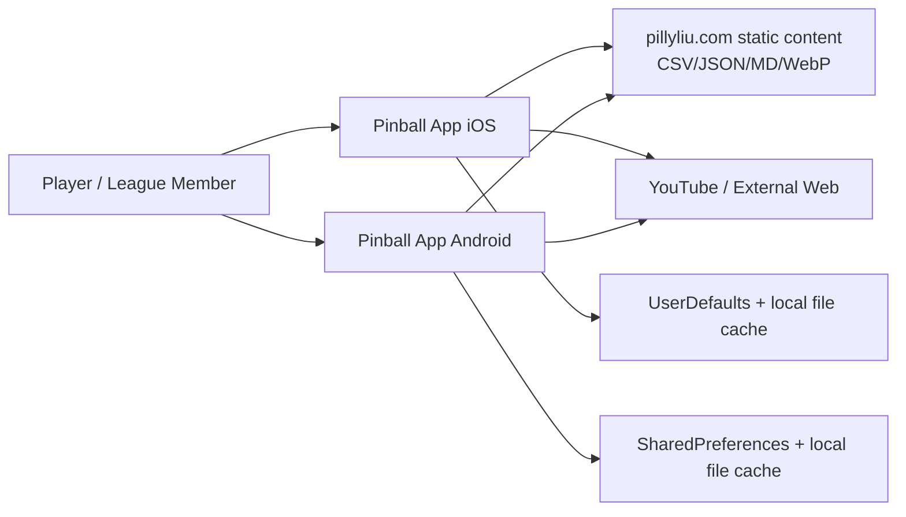

## 3.2 Container Diagram (C2)

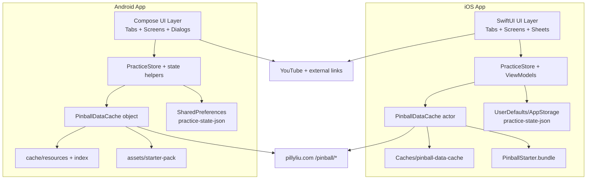

## 3.3 Component Diagrams (C3)

### League

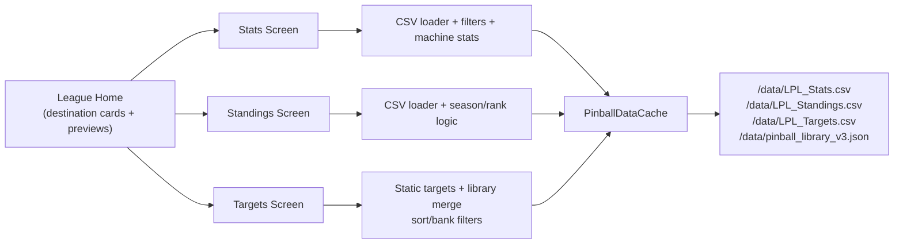

### Library

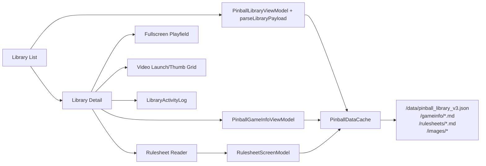

### Practice

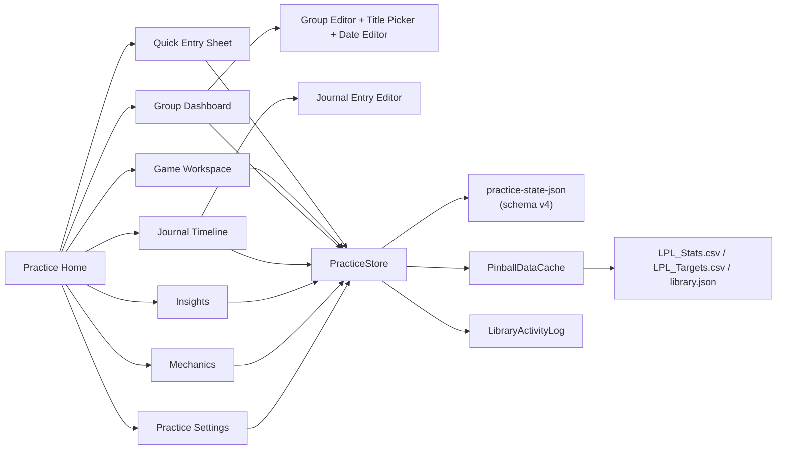

## 3.4 Code-Level Diagram (C4, feasible)

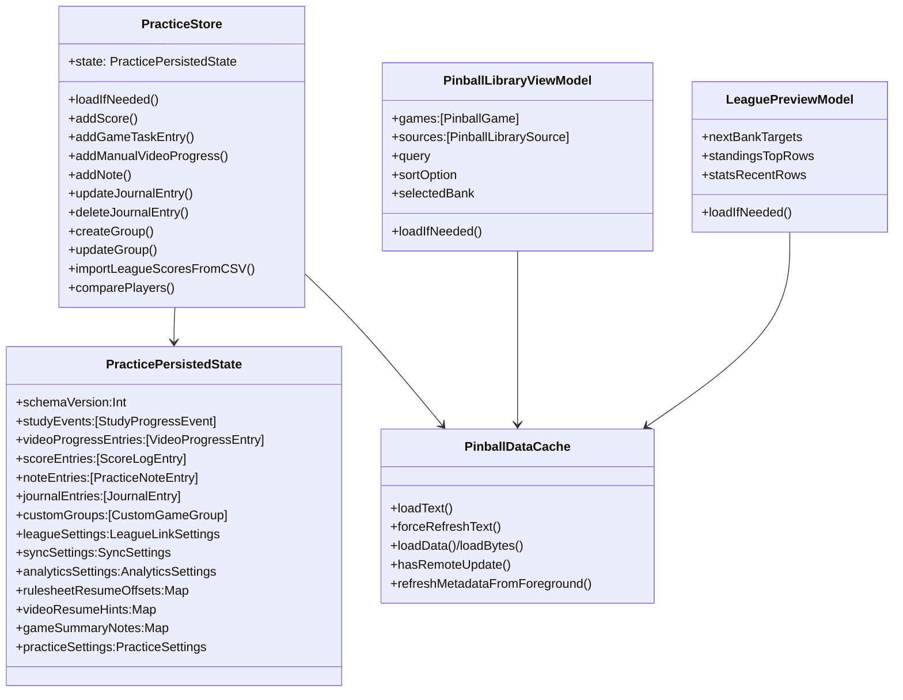

---

# 4. Screen and Feature Inventory

## Global root screens (both platforms)
1. **League tab**
2. **Library tab**
3. **Practice tab**
4. **About tab**

## League family
1. **League Home**
- Purpose: gateway cards to `Stats`, `Standings`, `Targets` with rotating preview snippets.
- Buttons/controls: destination cards; animated preview mode switches.
- Navigation: to each detail screen.
- Data reads: targets/standings/stats/library files + preferred player from practice defaults.
- Data writes: none.

2. **Stats**
- Purpose: row-level league score table + machine stat panel.
- Buttons:
  - Refresh timestamp row (manual refresh)
  - Filter button/menu
- Filters:
  - Season
  - Bank
  - Player
  - Machine
  - Clear-all filters
- Controls: dropdown menus, filter sheet/menu, horizontal+vertical table scroll.
- Reads: `/pinball/data/LPL_Stats.csv`, remote-update flag.
- Writes: in-memory UI selection only.

3. **Standings**
- Purpose: season standings table with rank, totals, bank breakdown.
- Buttons:
  - Refresh timestamp row
  - Filter button/menu
- Filters: season picker.
- Reads: `/pinball/data/LPL_Standings.csv`, remote-update flag.
- Writes: in-memory selected season only.

4. **Targets**
- Purpose: target benchmarks (2nd/4th/8th) with sort/bank filtering.
- Buttons/controls:
  - Sort selector
  - Bank selector
  - Filter sheet/menu
- Filters:
  - Sort: Area/Bank/A-Z
  - Bank: all or specific
- Reads:
  - local target baseline constants
  - `/pinball/data/pinball_library_v3.json` for ordering/bank mapping
- Writes: in-memory filter state only.

## Library family
1. **Library List**
- Purpose: browse all games by source with search/sort/filter.
- Buttons/controls:
  - Search field/icon
  - Filter menu
  - Sort menu
  - Source menu
  - Bank filter menu
  - Game cards
- Filters:
  - Source/library
  - Sort (Area/Bank/A-Z/Year; options vary by source type)
  - Bank (venue sources with bank data)
  - Search text
- Navigation: open game detail.
- Reads: `/pinball/data/pinball_library_v3.json`.
- Writes:
  - preferred source ID (`preferred-library-source-id`)
  - deep-link navigation handoff state (iOS `AppNavigationModel`).

2. **Library Detail**
- Purpose: game image/meta/video/info and resource links.
- Buttons:
  - `Rulesheet`
  - `Playfield`
  - `Open in YouTube`
  - Source links (`Rulesheet (source)`, `Playfield (source)`)
  - Back controls
- Controls: video thumbnail selection, markdown view, image loaders.
- Navigation:
  - to Rulesheet screen
  - to Playfield fullscreen
- Reads:
  - gameinfo markdown candidate paths
  - playfield/media URLs
- Writes:
  - activity log events (`browseGame`, `openRulesheet`, `openPlayfield`, `tapVideo`)
  - last viewed library game ID/timestamp.

3. **Rulesheet Reader**
- Purpose: fullscreen markdown rulesheet with resume-from-last-position.
- Buttons:
  - progress pill (save current progress)
  - back button
  - resume prompt (`Yes/No`)
- States: loading/missing/error/loaded.
- Reads: rulesheet markdown path candidates.
- Writes:
  - progress ratio keyed by game slug (UserDefaults / Android prefs + practice resume map).

4. **Playfield Fullscreen**
- Purpose: zoom/pan full-resolution playfield image.
- Buttons: back, optional source link fallback.
- Controls: pinch zoom, double-tap zoom, chrome auto-hide.
- Reads: image candidates local/remote.
- Writes: none.

## Practice family
1. **Practice Home**
- Purpose: resume workflow, quick entry launch, active groups summary, feature mini-cards.
- Buttons/controls:
  - Settings (gear)
  - Resume card
  - Library source dropdown
  - Game list dropdown
  - Quick actions: `Score`, `Study`, `Practice`, `Mechanics`
  - Active-group game chips
  - Destination cards: Group Dashboard / Journal / Insights / Mechanics
- Reads: practice state + library games + selected group + last viewed game.
- Writes:
  - selected game
  - quick-entry memory keys
  - last viewed practice timestamp
  - selected library source for practice.

2. **Name Prompt Overlay** (first-time or missing name)
- Controls:
  - player name field
  - toggle `Import LPL stats`
  - `Not now`, `Save`
- Writes: practice profile name; optional auto league import setup.

3. **Quick Entry Sheet**
- Purpose: fast logging by mode.
- Modes:
  - Score
  - Rulesheet
  - Tutorial video
  - Gameplay video
  - Playfield
  - Practice
  - Mechanics
- Buttons: `Cancel`, `Save`.
- Filters/selectors:
  - location/source
  - game
  - activity (study mode)
  - score context (`Practice/League/Tournament`)
  - video input kind (`hh:mm:ss` or `%`)
  - practice type
  - mechanics skill + competency slider
- Writes:
  - score entries
  - study/video progress
  - practice sessions
  - mechanics notes (auto-tagged)
  - journal rows
  - remembers last game/source per quick-entry origin.

4. **Game Workspace**
- Purpose: game-focused workspace with three subviews.
- Subviews:
  - Summary
  - Input
  - Log
- Top controls:
  - game/library filter menu
  - segmented `Mode` picker
- Summary: next action, alerts, score stats, target stats, group progress.
- Input buttons: `Rulesheet`, `Playfield`, `Score`, `Tutorial`, `Practice`, `Gameplay`.
- Log:
  - swipe/edit/delete entries
  - opens journal editor sheet.
- Resource section:
  - Rulesheet / Playfield nav
  - video selection + `Open in YouTube`.
- Game Note:
  - text editor + `Save Note`.
- Writes:
  - browse journal event
  - new score/task/video entries
  - updated/deleted journal items
  - game summary notes
  - viewed game timestamps.

5. **Group Dashboard**
- Purpose: manage and monitor practice groups.
- Controls:
  - group filter segmented (`Current`/`Archived`)
  - create (`+`)
  - edit (`pencil`)
  - select group row
  - priority toggle
  - start/end date popovers (`Clear`/`Done`)
  - row swipe actions (`Archive/Restore`, `Delete`)
  - group game row context delete
- Reads: group list, task progress, focus recommendations.
- Writes:
  - group CRUD
  - priority, archived flag, active flag
  - dates
  - remove title from group.

6. **Group Editor**
- Purpose: create/update group definitions.
- Controls:
  - group name field
  - template picker (`None`, `Bank Template`, `Duplicate Group`)
  - template apply buttons
  - title picker launcher
  - title reorder drag/drop; delete title confirmation
  - toggles: active, priority, archived
  - type picker
  - position up/down
  - date toggles + popover calendar
  - toolbar: `Cancel`, `Create/Save`, delete group
- Writes: group creation/update/deletion/reorder and selected group assignment.

7. **Group Title Selection Screen**
- Purpose: select titles for group.
- Controls:
  - searchable list
  - library filter picker
  - per-title check toggle
- Writes: selected game IDs for group editor.

8. **Journal Timeline**
- Purpose: merged timeline of practice journal + library activity.
- Controls:
  - filter segmented (`All`, `Study`, `Practice`, `Scores`, `Notes`, `League`)
  - edit mode toggle
  - batch `Edit`, batch `Delete`
  - row tap to open game
  - swipe row actions (`Edit`, `Delete`) for editable entries
- Writes:
  - selected edit IDs (UI)
  - edited/deleted journal entries.

9. **Journal Entry Editor Sheet**
- Purpose: edit existing practice journal records.
- Controls depend on action type:
  - Score editor + context/tournament
  - Note editor + category/detail
  - Study/playfield/practice progress + note
  - Tutorial/gameplay video format/value + progress + note
- Buttons: `Cancel`, `Save`.
- Writes: updates canonical journal + corresponding underlying score/note/study/video entry.

10. **Insights**
- Purpose: score distribution/trend and player-vs-player comparisons.
- Controls:
  - game dropdown (with library source scope)
  - opponent dropdown
  - refresh button
- Reads:
  - local score summaries/trends
  - league CSV for player list and head-to-head.
- Writes: selected opponent and selected source/game UI states; comparison player in settings state.

11. **Mechanics**
- Purpose: skill competency logging and trend history.
- Controls:
  - skill dropdown
  - competency slider
  - notes field
  - `Log Mechanics Session`
  - link to Dead Flip tutorials
- Reads: detected mechanics tags from note corpus.
- Writes: mechanics note entry + journal append.

12. **Practice Settings**
- Sections:
  - Practice profile (name + save)
  - League import (player picker + import action)
  - Defaults (cloud sync toggle placeholder)
  - Reset (`Reset Practice Log`)
- Writes:
  - profile name
  - league selected player + auto-fill flag
  - cloud sync flag/phase text
  - full local practice reset.

13. **Reset Confirmation Dialog**
- iOS: typed confirmation `reset`; Android confirm dialog.
- Writes: clears practice persisted state + clears library activity log (iOS).

## About
- Purpose: static LPL information and outbound links.
- Buttons: website link, Facebook group link.
- Reads/Writes: no data persistence writes.

---

# 5. Screen Interaction Diagrams

## Stats screen state + flow

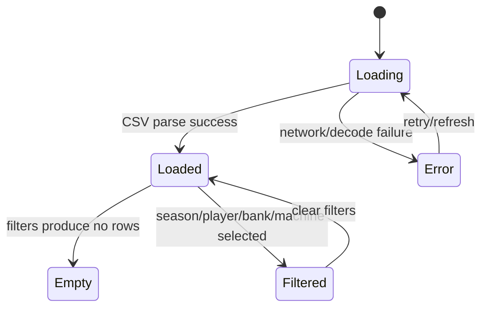

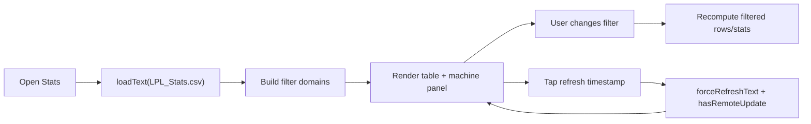

## Library list + detail flow

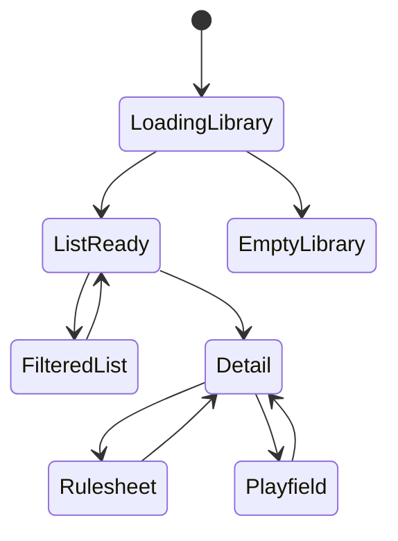

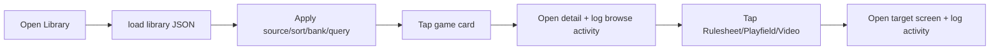

## Practice home + quick entry flow

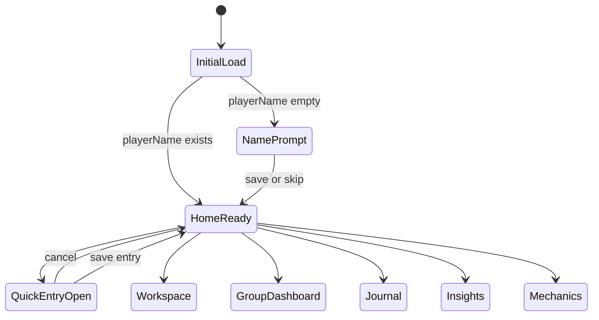

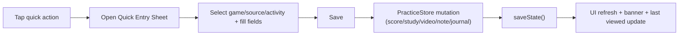

---

# 6. Sequence Diagrams (Behavior)

## App launch

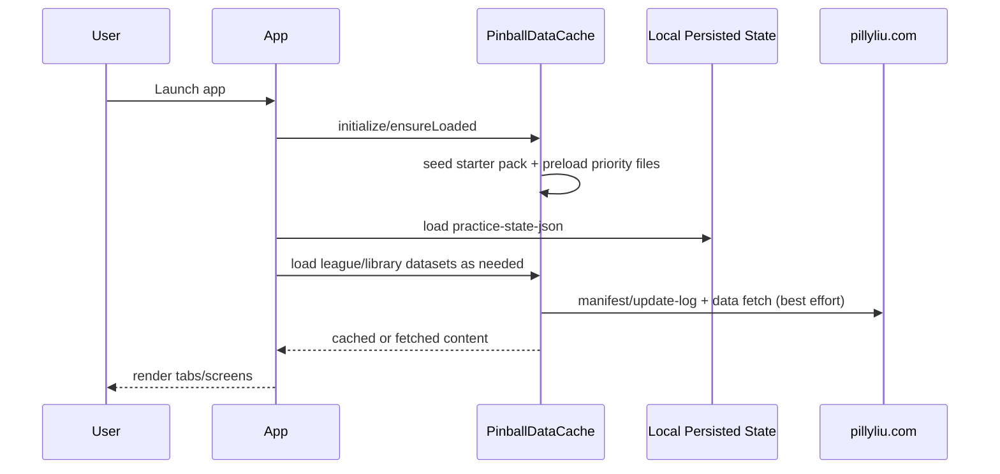

## Opening a game (Library -> Practice continuation)

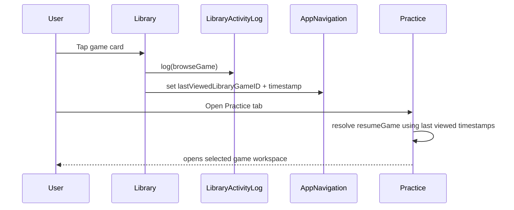

## Applying a filter (example: standings season)

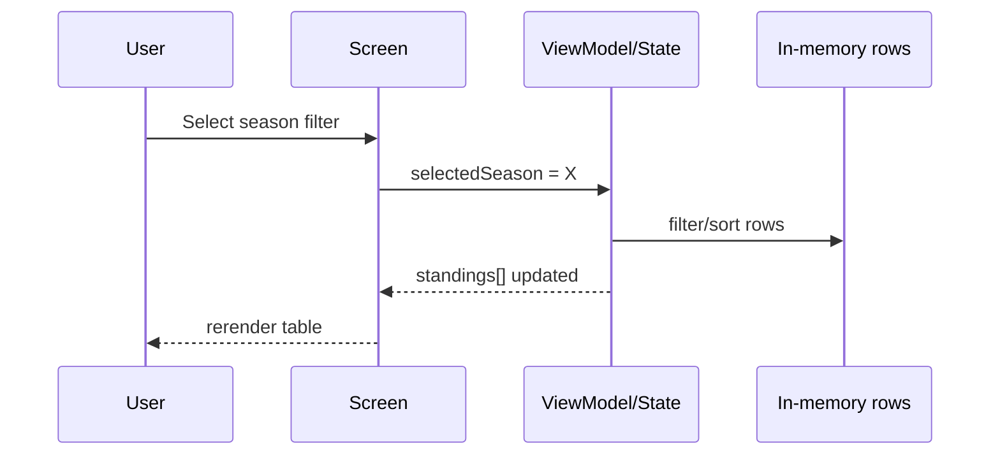

## Saving user data (quick score entry)

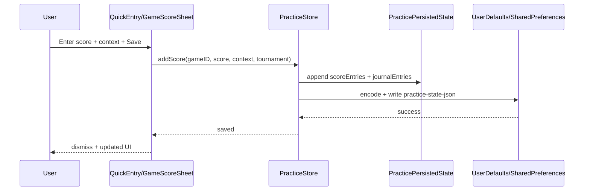

## Sync/update remote data metadata

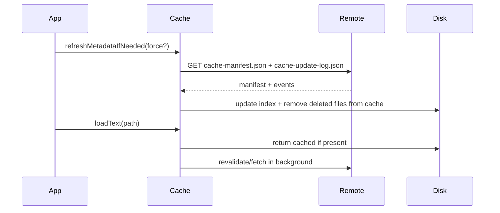

## League CSV import to practice state

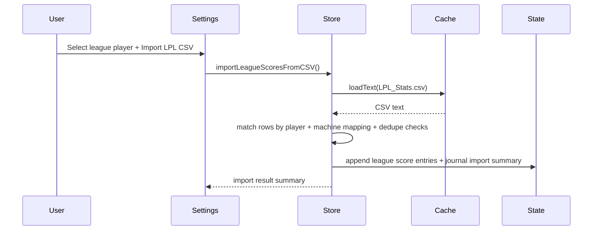

---

# 7. Data Model and Storage

## Primary entities/tables (local persisted model)

- `PracticePersistedState` (schema version `4`)
- `StudyProgressEvent`
  - `id`, `gameID`, `task`, `progressPercent`, `timestamp`
- `VideoProgressEntry`
  - `id`, `gameID`, `kind`, `value`, `timestamp`
- `ScoreLogEntry`
  - `id`, `gameID`, `score`, `context`, `tournamentName?`, `timestamp`, `leagueImported`
- `PracticeNoteEntry`
  - `id`, `gameID`, `category`, `detail?`, `note`, `timestamp`
- `JournalEntry`
  - denormalized event timeline linking score/study/video/note/browse actions
- `CustomGameGroup`
  - `id`, `name`, `gameIDs[]`, `type`, `isActive`, `isArchived`, `isPriority`, `startDate?`, `endDate?`, `createdAt`
- `LeagueLinkSettings`
  - `playerName`, `csvAutoFillEnabled`, `lastImportAt?`
- `SyncSettings`
  - `cloudSyncEnabled`, `endpoint`, `phaseLabel`
- `AnalyticsSettings`
  - `gapMode`, `useMedian`
- Resume/notes maps:
  - `rulesheetResumeOffsets[gameID]`
  - `videoResumeHints[gameID]`
  - `gameSummaryNotes[gameID]`
- `PracticeSettings`
  - `playerName`, `comparisonPlayerName`, `selectedGroupID?`
- Library activity side-log:
  - `LibraryActivityEvent`: `id`, `gameID`, `gameName`, `kind`, `detail?`, `timestamp`

## Storage locations
- **Practice state key**: `practice-state-json`
- **Legacy read key**: `practice-upgrade-state-v1`
- **Library activity key** (iOS): `library-activity-log-v1`
- **Preferred source key**: `preferred-library-source-id`
- **Quick-entry memory keys**: `practice-quick-game-*`
- **Rulesheet progress key**: `rulesheet-last-progress-<slug>` (iOS reader)
- **Cached remote files**: hashed resources + index in cache directory

## Load/cache/update strategy
- Cache-first for static content.
- If cached file exists:
  - return immediately
  - schedule async revalidation.
- If no cache and offline:
  - return stale if available
  - throw or mark missing when `allowMissing=true`.
- Starter pack seeds first launch.
- Metadata refresh checks manifest/update log; removes deleted cached paths.
- Practice state always local write-through after mutation.

## ER diagram

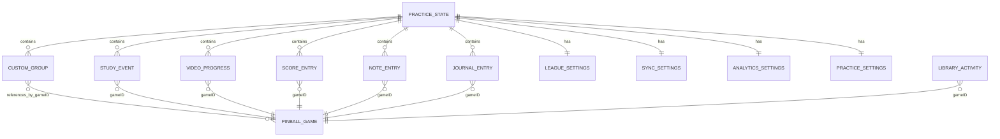

---

# 8. Data Flow Diagrams

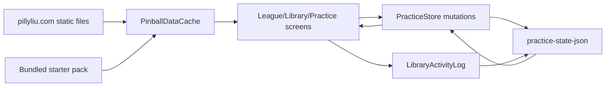

```mermaid
flowchart TB
    subgraph "Practice Write Path"
      UI["Quick Entry / Workspace / Settings / Group Editor"] --> Mut["PracticeStore mutation"]
      Mut --> Canon["Canonicalized game IDs + state reconciliation"]
      Canon --> Save["Serialize state (schema v4)"]
      Save --> Local["UserDefaults / SharedPreferences"]
      Local --> Readback["Reloaded state on next launch"]
    end
```

---

# 9. Navigation Map

```mermaid
flowchart TD
    Root["Root Tabs"] --> League["League"]
    Root --> Library["Library"]
    Root --> Practice["Practice"]
    Root --> About["About"]

    League --> LStats["Stats"]
    League --> LStandings["Standings"]
    League --> LTargets["Targets"]

    Library --> LibList["Library List"]
    LibList --> LibDetail["Library Detail"]
    LibDetail --> LibRulesheet["Rulesheet"]
    LibDetail --> LibPlayfield["Playfield"]

    Practice --> PHome["Practice Home"]
    PHome --> PQuick["Quick Entry"]
    PHome --> PGame["Game Workspace"]
    PHome --> PGroup["Group Dashboard"]
    PHome --> PJournal["Journal Timeline"]
    PHome --> PInsights["Insights"]
    PHome --> PMechanics["Mechanics"]
    PHome --> PSettings["Practice Settings"]

    PGroup --> PEditor["Group Editor"]
    PEditor --> PTitlePicker["Group Title Picker"]
    PJournal --> PJournalEdit["Journal Entry Editor"]
```

## Deep links / cross-screen handoff
- Explicit in-app deep-link style handoff:
  - iOS: `AppNavigationModel.libraryGameIDToOpen` can open a specific library game.
- Practice resume logic uses last viewed IDs/timestamps from Library and Practice.
- No URL-scheme deep links are implemented in code.

---

# 10. Error, Offline, and Edge Cases

## Data load failures
- League/library fetch failures show fallback error text.
- If library JSON fails, list can show `No data loaded`.
- Rulesheet/game info use `allowMissing`; explicit missing state shown.

## Offline behavior
- Cache layer returns stale cached data when network fails.
- Starter-pack files bootstrap offline-first behavior on first launch.
- If offline and uncached non-optional path: error is surfaced.

## Update/sync conflicts
- No multi-device merge logic (cloud sync is placeholder toggle only).
- Last-write-wins local state in single-device context.
- Journal edit/delete reconciles linked source entries (score/note/study/video).

## Empty states
- Stats/Standings/Targets tables display no-row guidance when filtered empty.
- Library detail handles missing media/info gracefully.
- Practice sections display no-data messages:
  - no groups
  - no journal events
  - no head-to-head overlap
  - no mechanics logs.

## Other edge handling
- Name redaction from `/pinball/data/redacted_players.csv`.
- Canonical game-ID migration for old slugs/IDs.
- Rulesheet resume prompt appears only when saved progress is meaningful.
- Dedupe protections:
  - Library activity anti-spam (~2s duplicate suppression)
  - League CSV import duplicate score detection by game/score/day.

---

# 11. Final Architecture Summary

The app is a **two-client, local-first architecture** backed by a **shared remote static content origin** (`pillyliu.com`). Both iOS and Android have the same domain model and feature topology: `League`, `Library`, `Practice`, and `About`.

Data flow is split into two lanes:
1. **Read lane**: remote CSV/JSON/markdown/images flow through `PinballDataCache` (cache-first, starter-seeded, background revalidated).
2. **Write lane**: all user-generated practice data flows through `PracticeStore` and is persisted locally as JSON state (`practice-state-json`, schema v4-compatible model).

Key architectural decisions:
- Offline-first content reliability through manifest-driven cache + bundled starter pack.
- No backend writes; all user state is device-local for speed and simplicity.
- Canonical game identity mapping to keep journal/group/history stable across library ID changes.
- Practice model centralization (`PracticeStore`) with strongly typed event entities and explicit mutation helpers.
- UI is compositional but feature-complete: rich nested screens/sheets/dialogs with deterministic data writes and replayable state.  

**Assumption labels**
- Android and iOS feature parity is high and intentionally mirrored; where exact UI control naming differs, behavior was inferred from matched store methods and shared route enums.
- `GameNoteEntrySheet` appears defined in iOS but not currently wired from visible UI paths (treated as dormant unless invoked elsewhere).
