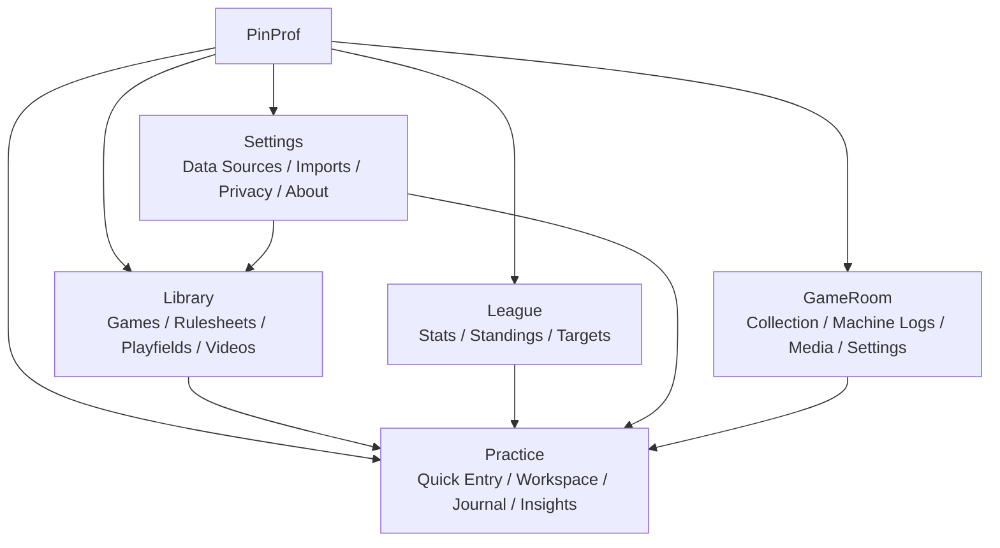
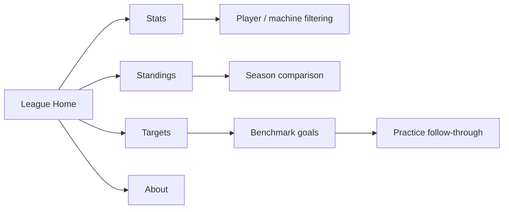
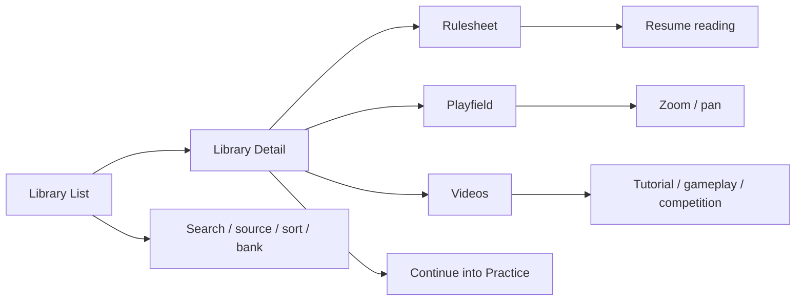
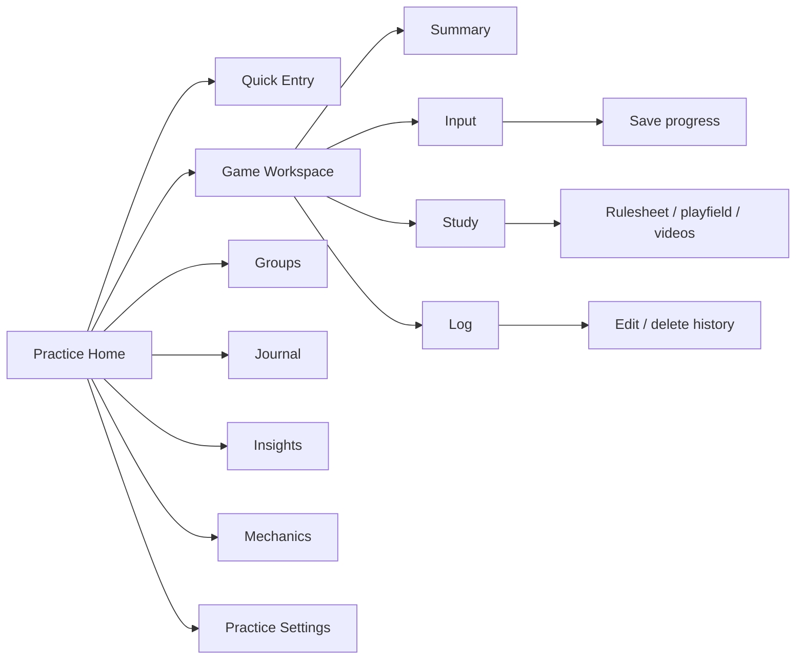
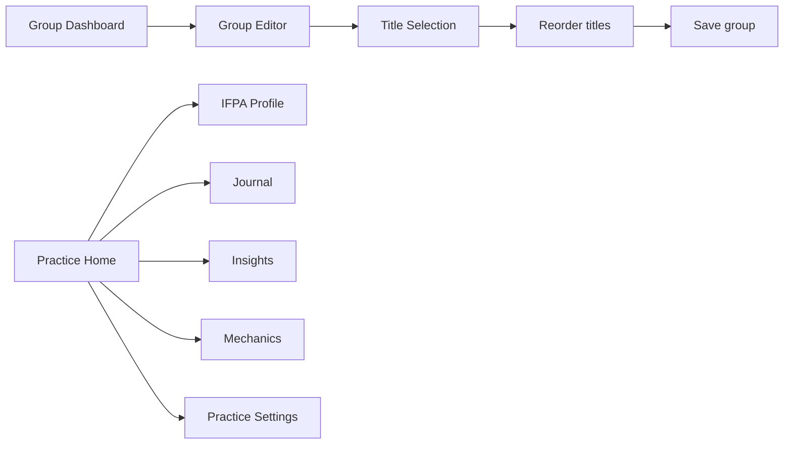
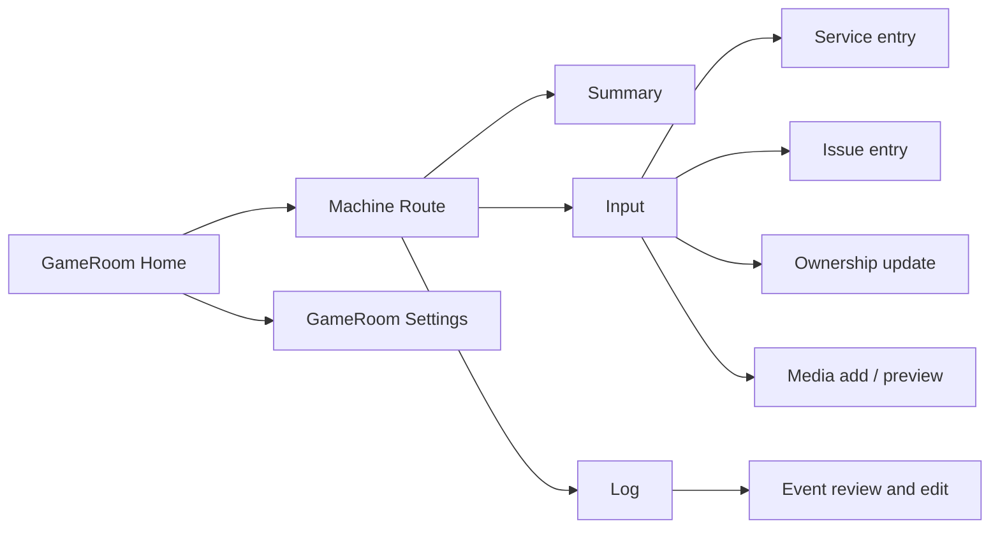
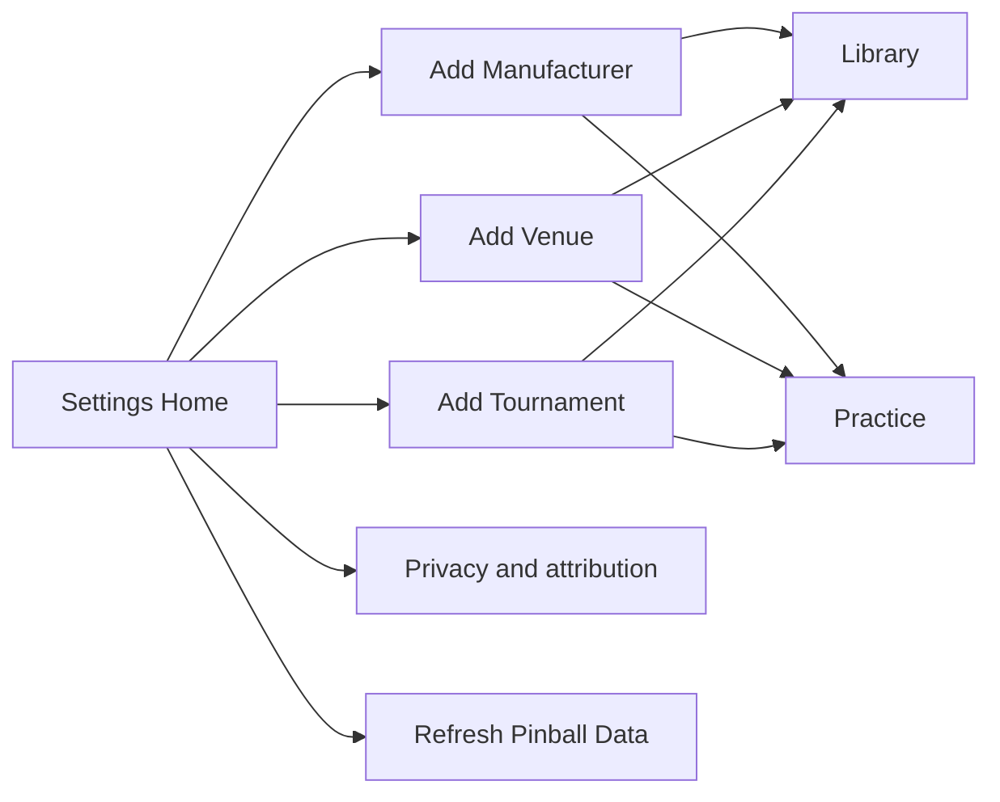
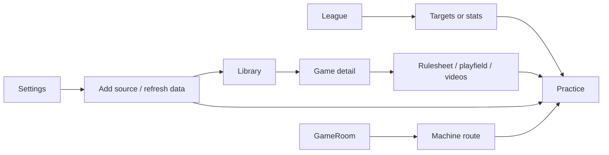

# 1. Guide Snapshot

## Document purpose
This guide is the current user-facing feature reference for PinProf version `3.4.7`.

It is designed for two jobs:
- serve as the feature inventory for future TipKit and instructional overlay planning
- act as the comprehensive product outline for future instructional video scripting

This document mirrors the structure and print style of the architecture blueprint, but intentionally stays at the feature and experience layer.

## What this guide covers
- the five root tabs that ship today on iOS and Android
- the primary destinations, screens, flows, and interactive surfaces users actually see
- the places where users are most likely to need discovery help, tap guidance, or short instructional overlays
- cross-tab journeys that matter for teaching the product clearly

## What this guide intentionally omits
- data structures
- persistence schemas
- cache internals
- platform-specific implementation details unless they change the user experience

## Release scope
- iOS app: `Pinball App 2`
- Android app: `Pinball App Android`
- target release: `3.4.7`

## Product summary
PinProf is a dual-platform pinball companion app for league players and home collectors. It helps users:
- see league performance and score targets
- browse rulesheets, playfields, videos, and game metadata
- log scores, study progress, practice sessions, and mechanics work
- organize practice into groups, journal history, and guided next actions
- manage a personal machine collection with service, issue, and media history

---

# 2. Product Experience Overview

## Core app story
At a user-facing level, PinProf works as one connected loop:
1. discover a machine or target
2. learn the machine through rulesheets, playfields, and videos
3. log practice or score progress
4. review history, trends, and next actions
5. repeat with more structure over time

## The five-tab mental model
1. `League`
- competitive context, standings, results, and targets

2. `Library`
- machine discovery and reference material

3. `Practice`
- the personal training hub, logging system, and analytics workspace

4. `GameRoom`
- machine ownership, maintenance, and collection tracking

5. `Settings`
- hosted data management, imports, privacy, and app-level controls

## Cross-platform parity posture
This guide assumes iOS and Android should stay functionally aligned within reason:
- the same root tabs should tell the same story
- the same major feature surfaces should exist on both platforms
- when a screen behaves differently, it should be because the platform benefits from a native adaptation, not because the product meaning changed

## Root experience map

## Product-wide guidance implications
- `League` is mostly explanatory and filter-driven, so guidance should focus on interpretation
- `Library` is discovery-heavy, so guidance should focus on resources, chips, and where to go next
- `Practice` is the deepest tab by far, so it deserves both onboarding help and contextual nudges
- `GameRoom` is stateful and operational, so guidance should focus on logging flows and collection management
- `Settings` is task-based, so guidance should focus on imports, refresh, and privacy meaning

---

# 3. League Feature Guide

## League at a glance
The `League` tab gives users competitive context. It is the tab that answers:
- how am I doing
- what are other players doing
- what scores should I be chasing

## Primary user-facing destinations
1. `League Home`
2. `Stats`
3. `Standings`
4. `Targets`
5. `About Lansing Pinball League`

## League Home
- What users see:
  - animated preview cards
  - destination cards for `Stats`, `Standings`, and `Targets`
  - a nested path into `About Lansing Pinball League`
- What users can do:
  - tap into each league destination
  - get a quick read on current league context before going deeper
- Why it matters for guidance:
  - the preview cards can introduce the value of the league module
  - the destination cards are good candidates for short "what lives here" messaging

## Stats
- What users see:
  - row-level score records
  - machine score tables
  - season, bank, player, and machine filters
  - refresh status row
- What users can do:
  - isolate a player
  - narrow the results to a season or bank
  - inspect machine-specific results
  - reset filters and re-orient quickly
- Why it matters for guidance:
  - this is one of the densest data views in the app
  - filter explanation and machine/player narrowing are likely high-value tip targets

## Standings
- What users see:
  - season standings in ranked form
  - season filter controls
  - current placement context
- What users can do:
  - switch seasons
  - understand relative position and movement
- Why it matters for guidance:
  - standings is easy to open but may need light explanation around how to read the view

## Targets
- What users see:
  - benchmark score targets
  - sort selector
  - bank selector
  - filter menu
- What users can do:
  - sort by different practical views
  - focus on a bank or target category
  - use the target values as training goals
- Why it matters for guidance:
  - this is the strongest bridge from `League` into `Practice`
  - target interpretation is a high-value instructional-video topic

## About Lansing Pinball League
- What users see:
  - league context
  - informational copy
  - external links
- What users can do:
  - understand the source context for the league data
  - open outbound references

## League guidance planning notes
- Best places for contextual tips:
  - destination cards on `League Home`
  - filters in `Stats`
  - sort and bank controls in `Targets`
- Best places for instructional-video narration:
  - how `Targets` connects to personal practice
  - how `Stats` and `Standings` answer different questions

## League experience map

---

# 4. Library Feature Guide

## Library at a glance
The `Library` tab is the reference and discovery system for the app. It answers:
- what machines are available
- what should I study for this game
- where can I see the rules, playfield, and videos

## Primary user-facing destinations
1. `Library List`
2. `Library Detail`
3. `Rulesheet`
4. `Playfield`
5. `Video resources`

## Library List
- What users see:
  - search field and search icon
  - source picker
  - sort menu
  - bank filter menu
  - game cards or rows
- What users can do:
  - search by title
  - switch between imported or available sources
  - reorder the catalog by sort mode
  - narrow the list by bank or grouping
  - open a game detail view
- Why it matters for guidance:
  - this is one of the app's main discovery surfaces
  - search, source, and sort are ideal compact-tip targets

## Library Detail
- What users see:
  - hero image
  - game metadata and info
  - rulesheet and playfield actions
  - video launcher and video tiles
  - external actions such as YouTube or web fallbacks where applicable
- What users can do:
  - inspect the game quickly
  - choose a rulesheet source
  - open the playfield
  - launch tutorial, gameplay, or competition videos
  - continue toward practice from the machine they just studied
- Why it matters for guidance:
  - it is a conversion surface from browsing into studying
  - resource chips and video actions are high-value discovery surfaces

## Rulesheet
- What users see:
  - readable rulesheet content when markdown is available
  - external-web fallback when the rulesheet is URL-only or cannot be parsed
  - progress and resume behavior
- What users can do:
  - read strategy information
  - scroll and resume later
  - switch from embedded content to external content when necessary
- Why it matters for guidance:
  - users may not immediately understand the difference between local, hosted, and external-web rulesheets
  - rulesheet-source chips are strong tip candidates

## Playfield
- What users see:
  - fullscreen or near-fullscreen playfield artwork
  - auto-hiding chrome
- What users can do:
  - pinch to zoom
  - double-tap zoom
  - pan around the image
- Why it matters for guidance:
  - gesture discovery matters here
  - this is a good place for short, non-intrusive gesture teaching

## Video resources
- What users see:
  - video groupings in a consistent order
  - `Tutorial` entries first, then `Gameplay`, then `Competition`
  - natural low-to-high sequence within each category
- What users can do:
  - open videos from library detail
  - use the same resource set later inside `Practice`
  - recognize the difference between study-focused and watch-focused video types
- Why it matters for guidance:
  - category meaning and ordering can be explained very quickly with small hints

## Library guidance planning notes
- Best places for contextual tips:
  - search and source controls on `Library List`
  - rulesheet and playfield chips on `Library Detail`
  - first video-launch surface
- Best places for instructional-video coverage:
  - how a user goes from search to detail to rulesheet or playfield
  - how to tell when a rulesheet opens in-app versus the web

## Library experience map

---

# 5. Practice Feature Guide

## Practice at a glance
The `Practice` tab is the personal training system. It is the deepest tab in the app and the one most likely to benefit from layered guidance.

It answers:
- what should I work on next
- how do I log progress quickly
- where is my study and score history
- how do I organize practice into focused plans

## Primary user-facing destinations
1. `Practice Home`
2. `Name Prompt / Welcome`
3. `Quick Entry`
4. `Game Workspace`
5. `IFPA Profile`
6. `Group Dashboard`
7. `Group Editor`
8. `Group Title Selection`
9. `Journal`
10. `Insights`
11. `Mechanics`
12. `Practice Settings`

## Practice Home
- What users see:
  - welcome header and player identity
  - source selector and game selector
  - recent or resume state
  - quick-entry buttons
  - active group summary
  - destination cards for groups, journal, insights, and mechanics
- What users can do:
  - choose the current library source and game
  - jump directly into fast logging
  - re-enter the current game workspace
  - open management or analysis destinations
- Why it matters for guidance:
  - this is the main command center of the app
  - it needs clear first-run orientation without feeling heavy

## Name Prompt / Welcome
- What users see:
  - player name capture
  - optional league linkage or import choice
  - save and dismiss actions
- What users can do:
  - personalize the app
  - connect league context to the practice identity
- Why it matters for guidance:
  - this is the natural home for first-run onboarding messaging
  - it sets the tone for the rest of the tab

## Quick Entry
- What users see:
  - mode picker
  - source and game selectors
  - entry-specific input fields
  - save action
  - optional score scanner path
- Supported modes:
  - `Score`
  - `Rulesheet`
  - `Tutorial`
  - `Gameplay`
  - `Playfield`
  - `Practice`
  - `Mechanics`
- Important input behavior:
  - video progress uses `Percentage` by default
  - the selector order is `Percentage` first, then `hh:mm:ss`
  - video entry exists in both quick entry and in-game input contexts
- What users can do:
  - log a score in seconds
  - record study progress against rulesheets, playfields, tutorials, or gameplay videos
  - log general practice or mechanics work
  - attach notes or context
  - scan a score from the camera flow where supported
- Why it matters for guidance:
  - it is one of the most important repeat-use features in the app
  - mode choice, source choice, and video-progress entry are likely strong tip targets

## Game Workspace
- What users see:
  - a selected-game header
  - the segmented workspace switcher above the main content card
  - a game note area that stays separate from the main panel
- Shared subviews:
  - `Summary`
  - `Input`
  - `Study`
  - `Log`

### Summary
- What users see:
  - next action guidance
  - alerts
  - score consistency signals
  - target context
  - group progress and practice status
- What users can do:
  - understand where they are with a game at a glance
  - choose the next logical step
- Guidance value:
  - summary is ideal for soft coaching and priority explanation

### Input
- What users see:
  - shortcut actions for:
    - `Rulesheet`
    - `Playfield`
    - `Score`
    - `Tutorial`
    - `Practice`
    - `Gameplay`
- What users can do:
  - log progress from inside a specific game context
  - stay inside the same workspace instead of returning to home
- Guidance value:
  - this surface is excellent for quick "what each button means" hints

### Study
- What users see:
  - rulesheet chips
  - playfield chips
  - video launcher and tiles
  - resource rows and supporting material
- What users can do:
  - move directly from a practice workspace into study material
  - keep study and logging tied to the same game
- Guidance value:
  - this is the best bridge from "learn" to "log"

### Log
- What users see:
  - filtered journal rows for the selected game
  - edit and delete affordances
- What users can do:
  - review what has already been logged for the game
  - correct or remove entries
- Guidance value:
  - edit/delete behavior may need a light tip if users miss that the log is actionable

### Game note
- What users see:
  - a freeform note area below the main workspace card
- What users can do:
  - save a broad note that is not tied to one single quick entry event
- Guidance value:
  - this is a good candidate for a "capture your own strategy note" nudge

## IFPA Profile
- What users see:
  - linked player identity state
  - IFPA-related information where applicable
- What users can do:
  - connect their personal practice identity to an IFPA profile
  - save an IFPA number
- Why it matters for guidance:
  - this is useful but not part of the main learning loop, so it likely needs lower-priority guidance

## Group Dashboard
- What users see:
  - current groups
  - archived groups
  - create and edit affordances
  - priority and date-window controls
- What users can do:
  - manage focused practice plans
  - archive or restore groups
  - open a title from group context
- Why it matters for guidance:
  - groups are powerful but more advanced than quick entry
  - they may deserve either a first-time overlay or a longer walkthrough segment

## Group Editor
- What users see:
  - group name
  - template options
  - selected title mini-cards
  - red `x` removal buttons in edit mode
  - drag-to-reorder behavior
  - active, archived, and priority controls
  - date windows
- What users can do:
  - build a focused training list
  - reorder titles
  - remove titles from the group
  - save or update the group definition
- Why it matters for guidance:
  - drag reorder and edit-only delete controls are high-value discovery points

## Group Title Selection
- What users see:
  - searchable game list
  - source filter
  - selection state
- What users can do:
  - add or remove games from a group efficiently
- Why it matters for guidance:
  - it is a secondary screen, but its relationship to the group editor should be easy to explain in a walkthrough

## Journal
- What users see:
  - merged timeline of practice and library activity
  - category filters
  - edit and delete affordances
  - row taps into the associated game
- What users can do:
  - inspect history
  - filter the timeline
  - correct data
  - jump back into the relevant game
- Why it matters for guidance:
  - timeline editing is a powerful trust-building feature and worth highlighting in a video

## Insights
- What users see:
  - derived performance analysis
  - comparisons, distributions, and trend surfaces
- What users can do:
  - understand score patterns
  - compare performance over time or against another context
- Why it matters for guidance:
  - this screen likely needs narrative explanation more than tap hints

## Mechanics
- What users see:
  - skill logs
  - competency progress
  - trend summaries
  - note capture
- What users can do:
  - track technical skills outside of one game-specific score loop
  - log mechanics progress over time
- Why it matters for guidance:
  - the distinction between game practice and mechanics practice may need a small clarifying tip

## Practice Settings
- What users see:
  - league-player linkage
  - import actions
  - analytics and sync preferences
  - reset and maintenance actions
- What users can do:
  - configure the practice profile
  - import league context
  - change behavior defaults
  - reset data when needed
- Why it matters for guidance:
  - this is not first-run critical, but destructive or import actions may need stronger explanation

## Practice guidance planning notes
- Best places for onboarding or overlays:
  - `Name Prompt / Welcome`
  - `Practice Home`
  - first entry into `Game Workspace`
- Best places for contextual tips:
  - quick-entry mode picker
  - workspace segmented selector
  - `Input` shortcuts
  - `Study` resource chips
  - group-editor reorder controls
- Best places for instructional-video coverage:
  - quick entry save flow
  - workspace `Summary / Input / Study / Log`
  - journal correction flow
  - group planning workflow

## Practice experience map

## Practice planning and organization map

---

# 6. GameRoom Feature Guide

## GameRoom at a glance
The `GameRoom` tab is the ownership and machine-operations system. It answers:
- what machines do I own or track
- what work has been done on them
- what issues, parts, or media belong to each machine

## Primary user-facing destinations
1. `GameRoom Home`
2. `Machine Route`
3. `GameRoom Settings`
4. `GameRoom Presentation flows`

## GameRoom Home
- What users see:
  - selected machine summary
  - collection cards or rows
  - snapshot metrics
  - routes into machine detail or GameRoom settings
- What users can do:
  - browse their collection
  - pick a machine quickly
  - jump into machine-specific detail
- Why it matters for guidance:
  - collection cards and rows are important entry points and should feel immediately understandable

## Machine Route
- What users see:
  - a machine-level detail route with segmented subviews:
    - `Summary`
    - `Input`
    - `Log`
  - current snapshot
  - machine metadata
  - service events
  - issue tracking
  - ownership and parts/mod records
  - media preview and fullscreen
- What users can do:
  - inspect the status of a machine
  - add service or issue events
  - review history
  - manage notes and media
- Why it matters for guidance:
  - the ownership workflow is powerful but can be dense for first-time users
  - it likely needs a short "this is where you log maintenance" explanation

## GameRoom Settings
- What users see:
  - Pinside import review
  - add-machine search
  - archive management
  - area management
  - edit-machine metadata surfaces
- What users can do:
  - build or extend a collection
  - import machine data
  - archive machines
  - manage where machines live
- Why it matters for guidance:
  - imports and archive state are meaningful concepts that likely need lightweight explanation

## GameRoom Presentation flows
- What users see:
  - service entry screens
  - issue entry and resolution flows
  - ownership update surfaces
  - media picker and preview paths
  - event edit flows
- What users can do:
  - log operational events without leaving the machine context
  - attach media to machine history
  - correct previous entries
- Why it matters for guidance:
  - these are the "do the work" surfaces of GameRoom and deserve clear walk-through coverage

## GameRoom guidance planning notes
- Best places for contextual tips:
  - collection entry cards
  - machine segmented selector
  - add-event entry buttons
- Best places for instructional-video coverage:
  - home to machine-detail transition
  - service log creation
  - issue tracking and resolution
  - import and archive management

## GameRoom experience map

---

# 7. Settings Feature Guide

## Settings at a glance
The `Settings` tab is the control center for hosted data, imports, privacy, and app-level information.

It answers:
- where does my library data come from
- how do I add more machines or sources
- how do I refresh hosted content
- how do I manage privacy and attribution

## Primary user-facing destinations
1. `Settings Home`
2. `Add Manufacturer`
3. `Add Venue`
4. `Add Tournament`
5. `Privacy and attribution`

## Settings Home
- What users see:
  - existing library sources
  - add-source actions
  - `Refresh Pinball Data`
  - privacy controls
  - about and attribution links
- What users can do:
  - inspect current content sources
  - refresh the hosted data payload
  - branch into source-import flows
  - review app and data-source information
- Why it matters for guidance:
  - refresh and add-source actions are core setup features
  - privacy and attribution are important but should stay lightweight

## Add Manufacturer
- What users see:
  - curated manufacturer-import path
- What users can do:
  - extend library and practice coverage with manufacturer-based content
- Why it matters for guidance:
  - users need to understand what gets added and why they would use it

## Add Venue
- What users see:
  - search or location-based venue discovery
  - radius controls
- What users can do:
  - import venue machine lists from Pinball Map
  - bring a real-world location into the app as a source
- Why it matters for guidance:
  - this is a good place for a focused setup walkthrough

## Add Tournament
- What users see:
  - tournament ID or URL entry
- What users can do:
  - import tournament arena lists from Match Play
  - add a temporary or event-specific source for browsing and practice
- Why it matters for guidance:
  - the input expectations may not be obvious, so this is a good tip candidate

## Privacy and attribution
- What users see:
  - privacy choices
  - full-name unlock or display options where applicable
  - attribution content
- What users can do:
  - make privacy decisions
  - review source and product credits

## Settings guidance planning notes
- Best places for contextual tips:
  - `Refresh Pinball Data`
  - add-source entry points
  - import inputs for venue and tournament flows
- Best places for instructional-video coverage:
  - what a source is
  - how venue and tournament imports affect `Library` and `Practice`

## Settings experience map

---

# 8. Cross-Tab Feature Journeys

## Why cross-tab flows matter
The app is strongest when users move between tabs with a clear purpose. These journeys are important not just for product clarity, but also for deciding where a tip should invite the next action.

## Library to Practice
- Typical journey:
  - search for a game in `Library`
  - open `Library Detail`
  - read a rulesheet, inspect a playfield, or watch a tutorial
  - move to `Practice`
  - log what was studied or practiced
- Why it matters:
  - this is the cleanest teaching loop in the product
  - it should almost certainly appear in the instructional video

## League to Practice
- Typical journey:
  - open `Targets` or `Stats`
  - identify a weak machine or a benchmark score
  - go to `Practice`
  - open the game workspace or quick entry
  - log progress toward the target
- Why it matters:
  - this turns league data into an action plan

## Settings to Library and Practice
- Typical journey:
  - add a manufacturer, venue, or tournament source in `Settings`
  - return to `Library`
  - browse the newly added source
  - continue into `Practice` with that source selected
- Why it matters:
  - this teaches that `Settings` is not isolated admin; it changes the rest of the app

## GameRoom to Practice
- Typical journey:
  - open a machine in `GameRoom`
  - review machine condition, notes, or service status
  - switch attention to `Practice` for gameplay improvement on the same title
- Why it matters:
  - this is a secondary loop, but it reinforces that ownership and practice can live side by side

## Cross-tab journey map

---

# 9. Guidance and Walkthrough Planning Lens

## Highest-value guidance moments
These are the places most likely to deserve user guidance because they are both important and easy to miss.

1. `Practice Home`
- source and game selection
- quick-entry launch behavior
- relationship between quick entry and the deeper game workspace

2. `Practice Game Workspace`
- segmented switcher meaning
- difference between `Input`, `Study`, and `Log`
- game note placement below the main panel

3. `Quick Entry`
- mode selection
- video progress entry
- score-scanner discovery

4. `Library Detail`
- rulesheet chips
- playfield access
- video category meaning

5. `Group Editor`
- drag reorder
- edit-only delete affordance via red `x`

6. `GameRoom`
- difference between machine summary, input, and log
- event creation versus history review

7. `Settings`
- what a library source is
- what `Refresh Pinball Data` actually changes

## Good candidates for first-run or versioned overlays
- the first `Practice Home` visit
- the first entry into `Game Workspace`
- the first time a user opens `GameRoom`
- major import or source-management improvements in `Settings`

## Good candidates for lightweight contextual tips
- library filters and source selection
- quick-entry mode picker
- practice input shortcuts
- study resource chips
- group reorder controls
- machine-event add buttons

## Best instructional-video spine
If one video needs to explain the product clearly, the strongest sequence is:
1. `League` for targets and context
2. `Library` for machine study
3. `Practice` for logging and review
4. `GameRoom` for ownership workflows
5. `Settings` for source imports and refresh

## Best short-demo sequence
For a shorter feature demo:
1. `Library List` search
2. `Library Detail` resource open
3. `Practice Quick Entry`
4. `Practice Game Workspace`
5. `Journal` review

---

# 10. Final Summary

## What this guide should help with next
This document is meant to be the feature map for:
- deciding which surfaces deserve TipKit
- deciding which moments deserve a branded instructional overlay instead
- sequencing a future instructional video so it follows the product's actual learning loop

## Current product shape in one sentence
PinProf `3.4.7` is a five-tab system where `League` provides context, `Library` provides study material, `Practice` provides the core logging and improvement loop, `GameRoom` provides ownership workflows, and `Settings` controls the data sources that feed the rest of the app.

## Decision lens going forward
When choosing what to teach, prioritize:
1. actions users repeat often
2. surfaces that convert browsing into logging
3. controls that are powerful but easy to miss
4. advanced flows that are valuable enough to justify explanation
